# L4 Code views

Level 4 views are repository-derived Mermaid diagrams or explicit TARGET tactical
design. They do not invent production classes and do not derive ownership from
packages. Each of the 11 frozen Bounded Contexts has a focused view.

| BC | Code-level focus |
|---|---|
| BC-01 Tenant & Access Governance | access context → policy → scoped persistence |
| BC-02 Customer & Buyer Relationships | relationship lifecycle → eligibility projection |
| BC-03 Catalog & Commercial Policy | offer resolution → immutable commercial snapshot |
| BC-04 Sales Commitment | PR → commitment → SO and outbox |
| BC-05 Inventory Availability | stock/lot → sellability → backing → allocation |
| BC-06 Fulfillment & Delivery | allocation → handoff → attempt → POD/continuation |
| BC-07 Credit & Receivables | reservation → receivable → application/correction |
| BC-08 Payments | provider ACL → verified callback → Payment → outbox |
| BC-09 Business Documents | source snapshot → immutable document → evidence |
| BC-10 Notifications | published fact → candidate → channel retry |
| BC-11 Business Traceability | source fact → append-only timeline projection |

These are TARGET logical seams unless marked AS-IS in the diagram. See the
[code views](code-views.md) for verified
repository references.

## Focused dependency views

Each view is intentionally a small logical path; names are domain roles, not
claims that production classes already exist.

```mermaid
flowchart LR
  subgraph BC01[BC-01 Access]
    A1[AccessContext] --> A2[CapabilityPolicy] --> A3[ScopedRepository]
  end
  subgraph BC02[BC-02 Relationships]
    B1[BuyerRelationship] --> B2[EligibilityProjection]
  end
  subgraph BC03[BC-03 Catalog]
    C1[OfferResolution] --> C2[CommercialSnapshot]
  end
  subgraph BC04[BC-04 Sales]
    D1[PurchaseRequest] --> D2[CommercialCommitment] --> D3[SalesOrder] --> D4[Outbox]
  end
  subgraph BC05[BC-05 Inventory]
    E1[InventoryLot] --> E2[SellableAvailability] --> E3[WarehouseBacking] --> E4[PhysicalAllocation]
  end
  subgraph BC06[BC-06 Fulfillment]
    F1[Fulfillment] --> F2[DispatchHandoff] --> F3[DeliveryAttempt] --> F4[POD_or_Continuation]
  end
  subgraph BC07[BC-07 Credit]
    G1[CreditReservation] --> G2[Receivable] --> G3[Application_or_Adjustment]
  end
  subgraph BC08[BC-08 Payments]
    H1[ProviderACL] --> H2[VerifiedCallback] --> H3[Payment] --> H4[Outbox]
  end
  subgraph BC09[BC-09 Documents]
    I1[SourceSnapshot] --> I2[IssuedDocument] --> I3[EvidenceReference]
  end
  subgraph BC10[BC-10 Notifications]
    J1[PublishedFact] --> J2[Candidate] --> J3[ChannelRetry]
  end
  subgraph BC11[BC-11 Traceability]
    K1[SourceFact] --> K2[AppendOnlyTimeline]
  end
```

AS-IS class/package evidence remains in the existing focused views. TARGET
paths preserve the accepted distinctions: commercial commitment is not
reservation, reservation is not physical allocation, Payment is not
Receivable, Dispatch Handoff is not POD, and Traceability is not source fact.
