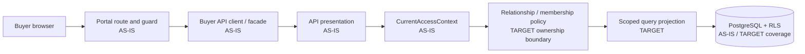
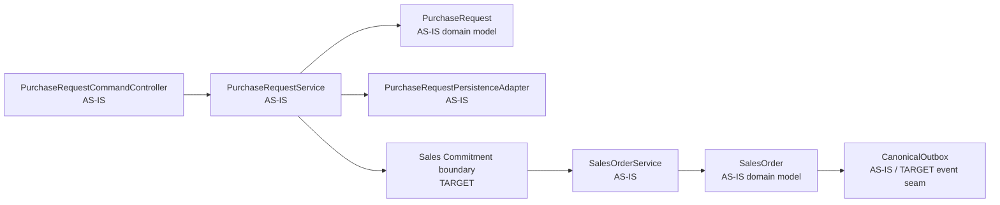
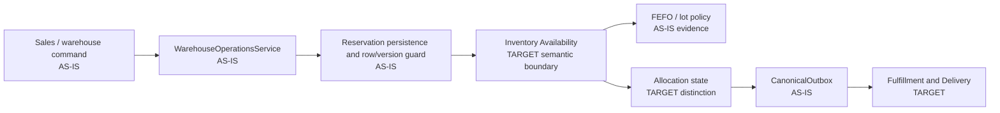
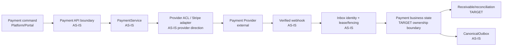
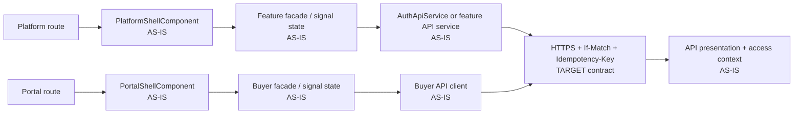

# Selective C4 Level 4 code views

These views are deliberately narrow. They show implementation seams that matter for PRE-V1 construction; they do not claim that current packages are Bounded Contexts. Current classes are marked `AS-IS`; accepted logical responsibilities are marked `TARGET`. The C4 guidance recommends using only levels that add value; these views exist because selected concurrency, security and provider seams need code-level traceability. See the [official C4 diagram guidance](https://c4model.com/diagrams).

## Customer access and Buyer relationship path

The browser supplies intent, not authority. `CurrentAccessContext` and the API authorization boundary must resolve Tenant, Workspace, membership/relationship and capability before the query reaches persistence.

## Purchase Request to Sales Order path

`Sales Commitment boundary` is a TARGET logical responsibility, not a current class. Purchase Request and Sales Order snapshots must preserve the decision made at submission/acceptance. `If-Match` and idempotency protect different retry/concurrency concerns.

## Commitment, reservation and allocation path

The target distinction is `Commercial Commitment != Inventory Reservation/Warehouse Backing != Physical Allocation != physical stock`. `RES` represents Inventory-owned reservation backing: it may span eligible Warehouses, selects no Lot, and protects full demand before later Physical Allocation. Existing reservation and FEFO behavior is preserved as evidence while accepted ownership and lifecycle language guide construction.

## Payment provider and reconciliation path

Payment is not synonymous with Stripe. Provider callbacks are authenticated, deduplicated and reconciled; capture success plus failed order creation remains an explicit operational state.

## Authenticated frontend to API path

Route guards improve navigation. Only the API and persistence scope enforce authorization. Loading, empty, forbidden, stale and conflict states are part of the frontend contract.
