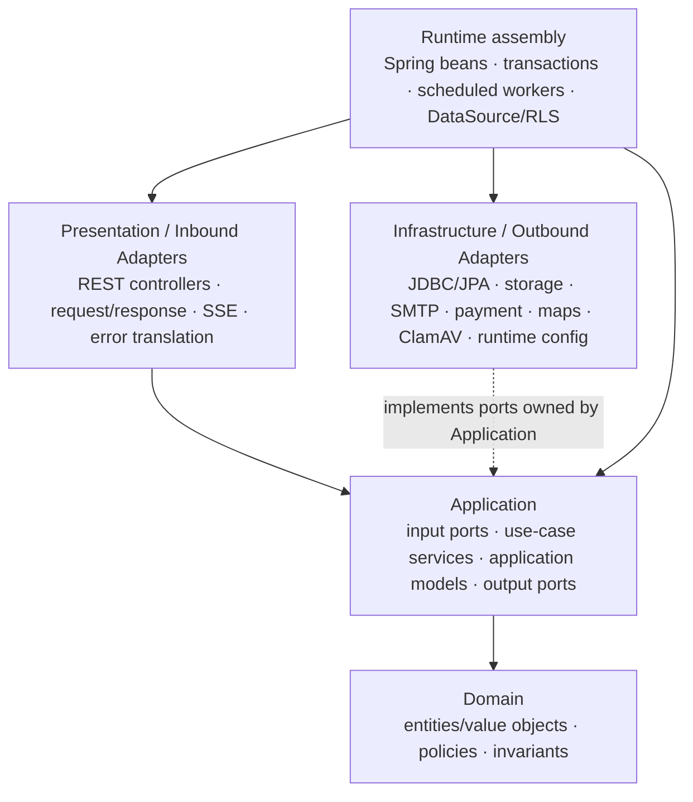

# API layering principles

## Question answered

**¿Qué dependencias internas debe preservar el Nexa Application API y qué se observa hoy en Spring Boot, sin reorganizar paquetes en esta tarea?**

Esto es evidencia y principio arquitectónico, no una refactorización. No se afirma “Clean Architecture” solo porque existan carpetas con nombres parecidos.

## Dependency direction

La flecha de implementación de Infrastructure hacia un port no significa que el dominio dependa de Spring. El ensamblaje de runtime conecta las implementaciones con los contratos internos.

## Layer contract

| Área | Regla que debe preservarse | Evidencia inspeccionada | Clasificación |
|---|---|---|---|
| Presentation / Inbound | Traducir HTTP/SSE, validación de transporte, status codes, headers y errores; invocar input ports o servicios de aplicación, no adapters de persistencia directos. | Controllers bajo `src/main/java/com/nexa/api/**/presentation`; `ArchitectureConstitutionTests` exige controllers en presentation y prohíbe dependencia directa de adapters `infrastructure.persistence`. | **CONFORMS** en los límites estáticos inspeccionados; la prueba completa no se rerun en esta tarea. |
| Application | Coordinar casos de uso, autorización contextual, transacciones/idempotencia cuando corresponda y puertos de salida; no depender de presentation ni JDBC. | `application/port`, `application/service`, `CurrentAccessContext`, `TenantTransactionalProxy`, `ArchitectureConstitutionTests`. | **CONFORMS / PARTIAL**: la regla está codificada y se observan puertos; algunas transacciones y coordinaciones viven en clases de infraestructura por el AS-IS. |
| Domain | Mantener comportamiento e invariantes sin Spring, JDBC, JPA ni serialización; no depender de capas exteriores. | `ArchitectureConstitutionTests`, `IamDddArchitectureTests`, `SalesArchitectureTests`, y modelos/policies en `domain`. | **CONFORMS** para las reglas inspeccionadas; **PARTIAL** como cobertura de todo el API porque la profundidad de dominio no es uniforme. |
| Outbound ports | Los contratos de persistencia/proveedor pertenecen hacia dentro, normalmente en `application.port.out`; el caso de uso no conoce el SDK o socket externo. | Ports de catálogo, sales, warehouse, storage, scanning, maps y pagos; implementaciones `Jdbc*`, `S3CompatibleObjectStorageAdapter`, `ClamAvContentScannerAdapter`, `GoogleMapsRoutingAdapter` y adapters locales. | **CONFORMS** en los caminos inspeccionados. |
| Infrastructure | Implementar ports, montar beans Spring y contener detalles JDBC/JPA/HTTP/SMTP/S3, seguridad y jobs. | Paquetes `infrastructure`, runtime configurations y adapters del API. | **CONFORMS / PARTIAL**: la separación existe, pero algunas clases de infraestructura también coordinan persistencia/transacciones por el diseño modular actual. |
| Spring Modulith | Modularizar el monolith sin presentar cada módulo como Bounded Context. | `@ApplicationModule`, `ApplicationModules.verify()` y tests de bootstrap; módulos `sales`, `warehouse`, `logistics`, `invoicing`, `payments`, `notifications` y `audit` están marcados abiertos. | **CONFORMS** como mecanismo de modularidad; **PARTIAL** como aislamiento, porque varios módulos son `OPEN`; Strategic DDD ownership is accepted and technical mapping remains construction work. |
| Cross-cutting | Seguridad, tenant context, RLS, auditoría, errores, observabilidad, outbox y workers deben atravesar las capas con contratos explícitos. | `CurrentAccessContextFilter`, `RlsRequestScope`, `RlsScopedDataSource`, `CanonicalOutboxEventProcessor`, filtros de correlación/traza y `ApiSecurityConfiguration`. | **PARTIAL**: hay mecanismos reales; cobertura completa, workers y bypasses controlados requieren Security/Data Architecture. |
| Conformidad global del repositorio | No aceptar que unas pocas pruebas arquitectónicas prueben todos los módulos, workers y rutas asíncronas. | Esta tarea inspeccionó reglas y caminos representativos; no ejecutó la suite completa ni un auditor exhaustivo de dependencias. | **UNKNOWN** hasta una auditoría específica; no se reporta como VIOLATION sin evidencia concreta. |

No se estableció una violación concreta en la inspección documental; tampoco se concede conformidad global a cada archivo. La clasificación `PARTIAL`/`UNKNOWN` conserva la diferencia entre una regla existente y una verificación completa del repositorio.

## Observaciones concretas del código actual

- El dominio inspeccionado no importa Spring/JDBC/JPA/serialización y ArchUnit codifica esa restricción.
- Los controllers reciben un `CurrentAccessContext` preparado por un filtro de seguridad y llaman a use cases/services; el transporte no resuelve por sí solo la membership.
- Los output ports permiten sustituir PostgreSQL, Object Storage, ClamAV, mapas, SMTP y pagos. El proveedor real no debe filtrarse al dominio.
- El API es un modular monolith: los módulos y paquetes expresan límites de implementación y pruebas, no una decisión de Bounded Context.
- `CanonicalOutboxEventProcessor`, workers de pagos/documentos y change feed muestran procesamiento asíncrono dentro del mismo API. La propagación de tenant context de esos procesos es una preocupación de seguridad independiente.

## Principios de evolución

1. Mantener `Domain <- Application <- Presentation` como dirección conceptual de dependencia.
2. Hacer que Infrastructure implemente ports inward-owned; no mover contratos al SDK o al adapter.
3. Mantener la traducción de transporte y serialización fuera del dominio.
4. Colocar invariantes en el dominio cuando el comportamiento esté descubierto y sea estable; no fabricar aggregates por nombres de paquetes.
5. Mantener transacciones, idempotencia, outbox y RLS como políticas explícitas; no esconderlas en una capa “utilitaria”.
6. Preserve accepted Strategic DDD ownership when implementing C4 L3 or reorganizing modules; current selective L3/L4 is a technical target view, not evidence that code already conforms.

## Referencias de evidencia

- [ArchitectureConstitutionTests](https://github.com/nexa-suite/api/blob/develop/src/test/java/com/nexa/api/architecture/ArchitectureConstitutionTests.java)
- [CurrentAccessContextFilter](https://github.com/nexa-suite/api/blob/develop/src/main/java/com/nexa/api/shared/infrastructure/security/CurrentAccessContextFilter.java)
- [RlsScopedDataSource](https://github.com/nexa-suite/api/blob/develop/src/main/java/com/nexa/api/shared/infrastructure/security/RlsScopedDataSource.java)
- [Spring Modulith module declarations](https://github.com/nexa-suite/api/blob/develop/src/main/java/com/nexa/api/catalogmanagement/package-info.java) and the corresponding module `package-info.java` files
- [AS-IS implementation baseline](../../../04-delivery/as-is/v1-implementation-baseline.md)
