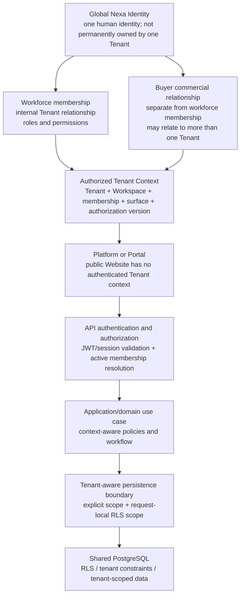

# Multi-tenant context propagation

## Question answered

**¿Cómo opera una identidad dentro de un Tenant autorizado y cómo llega esa decisión hasta la persistencia sin convertir Tenant en una capa física?**

La respuesta es un flujo de autorización y contexto. Tenant no es una aplicación, un Docker container ni una capa horizontal de despliegue. V1 mantiene `Tenant 1:1 Workspace`, pero `Tenant != Workspace`.

## Modelo conceptual

El diagrama expresa relaciones autorizadas, no tablas o aggregates finales.

## Propagación observada en el API

1. El JWT identifica la persona/sesión y contiene una instantánea de `tenant_id`, `workspace_id`, `membership_id`, `surface`, roles/permisos y versión de autorización.
2. `CurrentAccessContextFilter` valida la sesión y vuelve a resolver la membership activa contra el almacenamiento; no confía solamente en el claim histórico.
3. `CurrentAccessContext` entrega al caso de uso `user`, `tenant`, `workspace`, `membership`, `surface`, permisos y versión de autorización.
4. El caso de uso aplica autorización y pasa el contexto a las consultas/comandos. Las consultas actuales también conservan explícitamente `tenant_id`/`workspace_id` en los caminos inspeccionados.
5. `RlsRequestScope` establece el alcance request-local. `RlsScopedDataSource` lo aplica y limpia en cada conexión pooled mediante `app.current_tenant_id` y `app.current_workspace_id`.
6. Las migraciones observadas habilitan y fuerzan RLS en grupos de datos tenant/workspace. Esto prueba un mecanismo real, no una afirmación de cobertura completa.

Evidencia directa: [CurrentAccessContextFilter](https://github.com/nexa-suite/api/blob/develop/src/main/java/com/nexa/api/shared/infrastructure/security/CurrentAccessContextFilter.java), [CurrentAccessContext](https://github.com/nexa-suite/api/blob/develop/src/main/java/com/nexa/api/tenantmanagement/application/model/CurrentAccessContext.java), [RlsRequestScope](https://github.com/nexa-suite/api/blob/develop/src/main/java/com/nexa/api/shared/infrastructure/security/RlsRequestScope.java), [RlsScopedDataSource](https://github.com/nexa-suite/api/blob/develop/src/main/java/com/nexa/api/shared/infrastructure/security/RlsScopedDataSource.java) y migraciones [V44](https://github.com/nexa-suite/api/blob/develop/src/main/resources/db/migration/V44__harden_authorization_rls_and_preview_throttle.sql), [V59](https://github.com/nexa-suite/api/blob/develop/src/main/resources/db/migration/V59__close_payments_runtime_actor_and_rls.sql), [V69](https://github.com/nexa-suite/api/blob/develop/src/main/resources/db/migration/V69__harden_direct_tenant_rls.sql) y [V72](https://github.com/nexa-suite/api/blob/develop/src/main/resources/db/migration/V72__harden_additional_direct_tenant_rls.sql).

## Workforce membership versus Buyer relationship

- **Workforce membership** habilita a una persona para operar la organización desde Internal Web Platform, con roles/permisos de administración, ventas, warehouse o dispatch.
- **Buyer commercial relationship** habilita una relación de cliente/comprador con un Tenant y controla el autoservicio B2B del Portal. No convierte al Buyer en workforce member.
- Una identidad global puede tener relaciones autorizadas con más de un Tenant. Cada request debe escoger y validar un contexto, y los datos no se mezclan por el hecho de compartir identidad.
- `Tenant Administrator` y `Company Owner` siguen siendo responsabilidades distintas aunque participen en el actor agrupado de C4 L1.
- `Workspace` es el entorno operativo V1 1:1 del Tenant; no se promueve a actor, sistema o container.

## Public Website y contexto anónimo

El Website puede enviar un `Contact/Request Demo` público al API. Esa interacción no crea automáticamente Tenant, Workspace, identity o membership. El API aplica sus propias reglas de validación/throttling para la entrada pública; no debe fabricarse un Tenant context desde un formulario anónimo.

## Background processing

El outbox y los workers actuales transportan `tenant_id`/`workspace_id` en eventos o recuperan el contexto de la tarea y establecen `RlsRequestScope` antes de operar. El actor técnico y el comportamiento de colas que pueden reclamar across-tenants son excepciones controladas que requieren Security/Data Architecture. La propagación en workers no se considera cerrada solo porque exista un ThreadLocal en requests.

## Aislamiento defendible en V1

El aislamiento se preserva como defensa compuesta:

- identidad y sesión válidas;
- membership activa y autorización de superficie/permisos;
- contexto Tenant/Workspace resuelto por el API;
- comprobaciones explícitas de alcance en casos de uso/adapters;
- RLS PostgreSQL y constraints tenant/workspace donde están implementados;
- auditoría, correlación, idempotencia y tratamiento seguro de workers.

No se afirma que una fila `tenant_id` aislada sea suficiente. La cobertura total de RLS, las políticas de system operator, los workers, los snapshots y los datos globales requieren una revisión posterior.

## No finalizado en este documento

No se definen tablas ni schemas físicos finales en esta propagation view. Aggregate roots, foreign keys and implementation RLS coverage must preserve accepted Strategic DDD/Data/Security ownership and remain implementation/Production Gate work.
