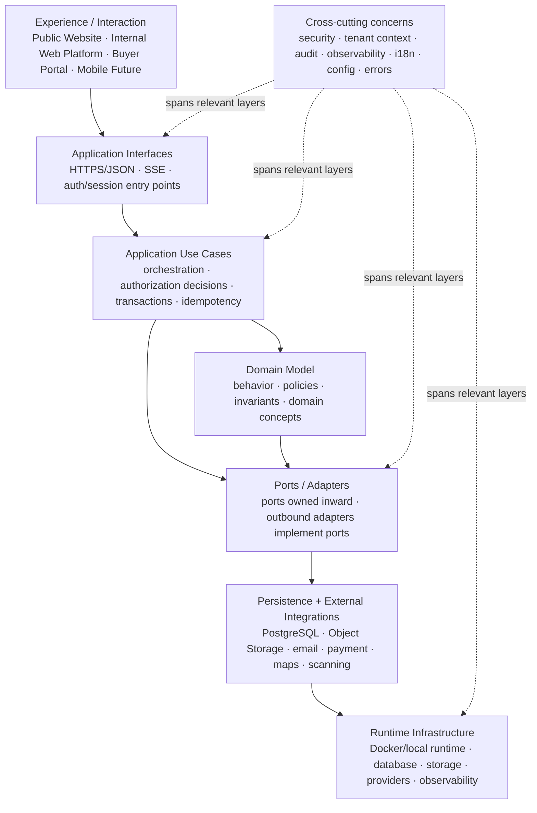

# Logical system layering

## Question answered

**¿Cómo fluyen las responsabilidades de Nexa desde la interacción de una persona hasta la persistencia y el runtime, sin confundir esta vista con C4 o Strategic DDD?**

Esta es una vista lógica separada del modelo C4. Describe responsabilidades y dependencias; no crea Bounded Contexts, subdomains, aggregates ni una arquitectura cloud final.

## Modelo resultante

## Layer responsibilities and evidence

| Layer | Nexa-specific responsibility | Current evidence | Boundary |
|---|---|---|---|
| Experience / Interaction | Presents public discovery, internal Tenant workflows, Buyer self-service and future mobile surfaces. | Website static HTML/CSS/JS; Platform and Portal Angular 22 routes, guards, facades, API clients and Nginx proxy. | Does not become authority for tenant isolation, pricing, inventory or order invariants. |
| Application Interfaces | Translates HTTP/SSE/session transport into application requests and responses. | API controllers under `presentation`, request/response models, error handler, change-feed stream; frontend HTTP clients and interceptors. | Transport concerns stay outside domain behavior. |
| Application Use Cases | Coordinates a user/system action, checks access, controls transaction/idempotency boundaries where observed and invokes ports. | API `application/port`, `application/service`, `CurrentAccessContext`, transactional services/proxies and outbox handoffs. | Not a final ownership map; current services may still cross implementation areas. |
| Domain Model | Holds behavior, policies, value objects, state transitions and invariants where the current implementation has modeled them. | API domain packages, FEFO policy, Sales Order and dispatch models, architecture tests excluding framework dependencies from inspected domain code. | Existing domain classes are evidence, not final Aggregates or Bounded Contexts. |
| Ports / Adapters | Keeps use cases independent of persistence/provider details. | Application input/output ports; JDBC/JPA, Object Storage, ClamAV, SMTP, payment and maps adapters in infrastructure. | Adapter names do not promote a provider or implementation into the business core. |
| Persistence + External Integrations | Persists relational state, binary objects and integration state; invokes external services through replaceable boundaries. | Flyway/PostgreSQL schemas and RLS migrations; S3-compatible/local storage; SMTP/Mailpit; deterministic/Stripe-compatible payment; local/Google Maps adapters. | Provider contracts, production credentials and complete ownership remain open. |
| Runtime Infrastructure | Runs the software and supporting services locally and exports telemetry. | `modern.compose.yml`, PostgreSQL, MinIO, ClamAV, Mailpit, WireMock, OTEL Collector and Jaeger. | Local Compose proves AS-IS composition only; it is not Cloud Deployment Architecture. |

## How the three application surfaces fit

- **Public Website** is an interaction surface for anonymous discovery and structured contact/demo intake. It may call the public API endpoint, but it does not carry an authenticated Tenant context for public browsing.
- **Internal Web Platform** is the authenticated surface for the grouped Tenant workforce. Its role differences are authorization and workflow differences inside one surface, not separate C4 containers or contexts.
- **Buyer Portal** is a separate authenticated surface because Buyer navigation, commercial self-service, tracking and account relationship behavior differ from internal workforce operations.
- **Mobile** is shown only as a runway interaction surface. It is not part of current V1 runtime evidence.

## Business logic placement without premature DDD

The current defensible placement is:

- application orchestration coordinates a use case and its authorized context;
- domain behavior protects invariants that are actually modeled;
- persistence and provider concerns stay behind outbound ports/adapters;
- transport translation stays in presentation/application interfaces;
- shared security, tenant propagation, audit, error and telemetry concerns cross the flow without becoming business layers.

The words “catalog”, “sales”, “warehouse”, “logistics”, “payments” and similar names remain implementation/evidence vocabulary. They are intentionally not asserted as final strategic boundaries.

## Cross-cutting concerns

These concerns span more than one layer and are not horizontal business layers:

- authentication, session validation and authorization;
- multi-tenant context propagation and tenant/workspace isolation;
- audit and security audit;
- observability, correlation, tracing, metrics and change feed;
- i18n and surface-specific presentation configuration;
- runtime configuration and secret/provider selection;
- transaction boundaries, idempotency, optimistic concurrency and outbox processing;
- error translation, problem details and retry/dead-letter behavior;
- background jobs and their explicit system-actor/context handling.

## Status and limits

This layering model is sufficient to explain the current system and to guide later refactoring decisions, but it is not a claim that every class conforms. The API-specific evidence and classifications are in [API layering principles](api-layering-principles.md); tenant context is in [Multi-tenant context propagation](../multi-tenancy/context-propagation.md).
