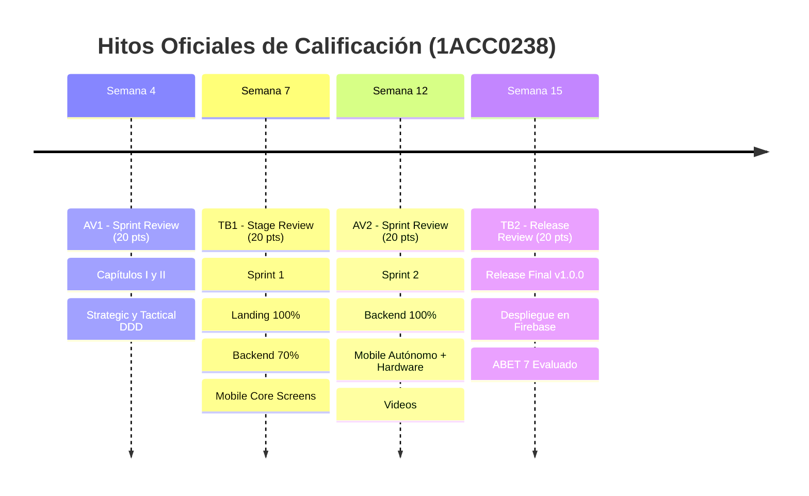

# RÚBRICA OFICIAL DETALLADA DE EVALUACIÓN
## Curso: 1ACC0238 Aplicaciones para Dispositivos Móviles
### Ciclo 2026-02 (202620) | Carrera de Ingeniería de Software | UPC

> [!NOTE]
> Este documento contiene el desglose exacto de los criterios de evaluación, niveles de desempeño y asignación de puntajes (20 puntos por hito) extraídos directamente de las matrices oficiales de calificación del curso (`final-project-rubric.xlsx`).

---

## 1. Primer Hito: AV1. Sprint Review — Fecha: Semana 4 (20 Puntos)
- **Tipo de Revisión:** `Sprint Review`
- **Puntaje Total:** `20 Puntos`

### 📊 Matriz Resumen de Criterios y Ponderaciones

| # | Categoría / Dimensión | Criterio de Evaluación | Sobresaliente | Esperado | Necesita Mejorar | Insuficiente |
| :---: | :--- | :--- | :---: | :---: | :---: | :---: |
| 1 | **Lean UX** | Ejecuta de forma adecuada el proceso de Lean UX para el Proyecto. | **1.25 Punto(s)** | 0.75 Punto(s) | 0.25 Punto(s) | 0 Punto(s) |
| 2 | **Needfinding** | Define de manera adecuada las preguntas dirigidas a los entrevistados y realiza adecuadamente las entrevistas, la recopilación de evidencias, análisis y elaboración de artefactos de needfinding. | **1.5 Punto(s)** | 0.75 Punto(s) | 0.25 Punto(s) | 0 Punto(s) |
| 3 | **Vision** | Define una propuesta de valor innovadora y diferenciada junto con el alcance del proyecto. | **1 Punto(s)** | 0.5 Punto(s) | 0.25 Punto(s) | 0 Punto(s) |
| 4 | **Product Design** | Identifica y define User Stories para el alcance del Producto. | **2 Punto(s)** | 1 Punto(s) | 0.5 Punto(s) | 0 Punto(s) |
| 5 | **Innovation** | Evidencia pensamiento innovador al identificar necesidades y elaborar la propuesta. | **0.5 Punto(s)** | 0.25 Punto(s) | 0.125 Punto(s) | 0 Punto(s) |
| 6 | **Design** | EventStorming. | **1.25 Punto(s)** | 0.75 Punto(s) | 0.25 Punto(s) | 0 Punto(s) |
| 7 | **Design** | Bounded Contexts & Context Mapping. | **1.25 Punto(s)** | 0.75 Punto(s) | 0.25 Punto(s) | 0 Punto(s) |
| 8 | **Design** | Software Architecture. Context, Container & Deployment Level Diagrams. | **1.75 Punto(s)** | 1 Punto(s) | 0.5 Punto(s) | 0 Punto(s) |
| 9 | **Design** | Bounded Context: Domain Layer. | **2 Punto(s)** | 1 Punto(s) | 0.5 Punto(s) | 0 Punto(s) |
| 10 | **Design** | Bounded Context: Interface Layer, Application Layer & Infrastructure Layer. | **1.75 Punto(s)** | 1 Punto(s) | 0.5 Punto(s) | 0 Punto(s) |
| 11 | **Design** | Bounded Context Software Architecture Component Level Diagrams. | **1.75 Punto(s)** | 1 Punto(s) | 0.5 Punto(s) | 0 Punto(s) |
| 12 | **Design** | Bounded Context Software Architecture Code Level Diagrams: Domain Layer Class Diagram & Database Diagram. | **2 Punto(s)** | 1 Punto(s) | 0.5 Punto(s) | 0 Punto(s) |
| 13 | **Communication** | Evidencia capacidad de comunicación oral y escrita de forma efectiva. | **2 Punto(s)** | 1 Punto(s) | 0.5 Punto(s) | 0 Punto(s) |

---

### 🔍 Desglose Detallado de Criterios de Evaluación (AV1)

#### Criterio 1: Ejecuta de forma adecuada el proceso de Lean UX para el Proyecto. (1.25 Punto(s))
- **Categoría:** `Lean UX` | **Puntaje:** `1.25 pts`

| Nivel de Desempeño | Puntaje | Descriptor / Evidencias Requeridas |
| :--- | :---: | :--- |
| 🌟 **Sobresaliente** | **1.25 Punto(s)** | La redacción del Problem Statement sigue el patrón de Lean UX y expresa con claridad el propósito del trabajo. Se evidencia la relación con los resultados de 5W+2H. Incluye el estado actual del mercado, la oportunidad que desea aprovechar así como la problemática desde la perspectiva de cada segmento objetivo. La redacción de Assumptions expresa supuestos en relación a: métricas de éxito y definition of done, grupos objetivo, los objetivos de estas personas, características de la solución que ayudaría alcanzar sus objetivos y obtener los business outcomes que se busca. Se toma como base el total de Assumptions para establecer los hypothesis statements, las cuales siguen el feature hypothesis statement template, evidenciando en cada statement, business outcome, users, user outcome y feature. Incluye cantidad adecuada de hypothesis statements en relación al problem statement. Cumple de forma completa con las especificaciones de enunciado para artefactos y secciones relacionados. |
| ✅ **Esperado** | **0.75 Punto(s)** | La redacción del Problem Statement sigue el patrón de Lean UX sin embargo expresa de forma parcial el propósito del trabajo. Se evidencia de forma parcial la relación con los resultados de 5W+2H. El enunciado incluye vagamente el estado actual del mercado, o no se expresa con claridad la oportunidad que el startup desea aprovechar, o el Problem Statement no incluye restricciones que se aplican. La redacción de Assumptions expresa de forma vaga los supuestos para el proyecto. La redacción toma como base el total de Assumptions para establecer los hypothesis statements, las cuales siguen el feature hypothesis statement template, evidenciando en cada statement, el business outcome, users, user outcome y feature. Si embargo, no incluye la cantidad adecuada de hypothesis statements en relación al problem statement. Cumple de forma parcial con las especificaciones de enunciado para artefactos y secciones relacionados. |
| ⚠️ **Necesita Mejorar** | **0.25 Punto(s)** | La redacción del Problem Statement no expresa el propósito del trabajo. El enunciado omite el estado actual del mercado, o no expresa la oportunidad que el startup desea aprovechar (por ejemplo, dónde otras soluciones están fallando). La redacción de Assumptions no incluye supuestos en relación a: métricas de éxito y definition of done (Business outcomes), grupos objetivo para quienes se ofrece la solución, cuáles son los objetivos de estas personas, características de la solución que ayudaría a los clientes alcanzar sus objetivos y obtener los business outcomes que se busca. La redacción no toma como base el total de Assumptions para establecer los hypothesis statements, o no siguen el feature hypothesis statement template, evidenciando en cada statement, el business outcome, users, user outcome y feature. Incluye muy pocos hypothesis statements en relación al problem statement. |
| ❌ **Insuficiente** | **0 Punto(s)** | El Problem Statement no se incluye, o no incluye Assumptions o estos no tienen relación con el Problem Statement, o no incluye hypothesis statements o estos no tienen relación con los Assumptions o el Problem Statement. |

#### Criterio 2: Define de manera adecuada las preguntas dirigidas a los entrevistados y realiza adecuadamente las entrevistas, la recopilación de evidencias, análisis y elaboración de artefactos de needfinding. (1.5 Punto(s))
- **Categoría:** `Needfinding` | **Puntaje:** `1.5 pts`

| Nivel de Desempeño | Puntaje | Descriptor / Evidencias Requeridas |
| :--- | :---: | :--- |
| 🌟 **Sobresaliente** | **1.5 Punto(s)** | Se realizó un benchmark de principales competidores, cumpliendo de forma completa con las especificaciones. Diseña de forma completa entrevistas aplicando buenas prácticas. Las preguntas son suficientes para cubrir las aristas de la investigación. Se entrevistó a la cantidad adecuada de personas (3 a 5 por segmento). Se realizó el registro adecuado de las entrevistas en video, con ambiente y abordaje adecuado, sin interrupciones, etc. Se formularon las variables adecuadas para el análisis de entrevistas. Se construyeron de forma adecuada las fichas de  Personas. Se incluyó todos los detalles necesarios para tipificarlas como un arquetipo completo. Se elaboró el User Task Matrix, con Tareas y para cada User Persona, se especificó la frecuencia e importancia de dichas tareas. Elabora de forma correcta los User Journey Mapping, Empathy Mapping y As-Is Scenario Mapping. Cumple de forma completa con las especificaciones de enunciado para artefactos y secciones relacionados. |
| ✅ **Esperado** | **0.75 Punto(s)** | Se realizó un benchmark pero de manera parcial. No todas las preguntas son formuladas de forma adecuada, o no se entrevistó a la cantidad adecuada de personas (menor a 3 por segmento), o no se realizó el registro adecuado de las entrevistas en video, o no se realizó la entrevistas de forma adecuada.  Se redactó el análisis de entrevistas evidenciando parcialmente características objetivas y subjetivas a utilizar para definir los User Persona. No se eligió de forma adecuada a los usuarios que conformarían los conjuntos para los User Persona. Se construyeron de forma parcialmente correcta las fichas de User Persona. No se incluyeron todos los detalles necesarios para tipificarlas como un arquetipo completo. Se elaboró el User Task Matrix, pero de forma incompleta. Elabora de forma parcialmente correcta o incompleta los User Journey Mapping, Empathy Mapping y As-Is Scenario Mapping. Cumple de forma parcial con las especificaciones de enunciado para artefactos y secciones relacionados |
| ⚠️ **Necesita Mejorar** | **0.25 Punto(s)** | Se realizó un benchmark de competidores, pero incumple la mayoría especificaciones de enunciado. El listado de preguntas a realizar no se relaciona con las aristas de la investigación, o la gran mayoria de las preguntas no son formuladas de forma adecuada, o no en todas la entrevistas se realizó el registro adecuado en video, o no se realizó las entrevistas de forma adecuada (ambiente adecuado, abordaje adecuado, sin interrupciones por parte del entrevistador, etc.), o no cumple con la mayoría de especificaciones. No se eligieron y formularon las variables adecuadas para el análisis de entrevistas, o no se asignó de forma adecuada a los entrevistados en los grupos de análisis, o no se eligió de forma adecuada a los usuarios que conformarían los conjuntos para los User Persona, o no se incluye el User Task Matrix, o no elabora User Journey Mapping, Empathy Mapping, As-Is Scenario Mapping, o incumple la mayoría de especificaciones. |
| ❌ **Insuficiente** | **0 Punto(s)** | No se realizó un benchmark de competidores. No se realizaron las entrevistas. No se redactó el análisis de entrevistas o los artefactos elaborados no tienen relación con las entrevistas realizadas. |

#### Criterio 3: Define una propuesta de valor innovadora y diferenciada junto con el alcance del proyecto. (1 Punto(s))
- **Categoría:** `Vision` | **Puntaje:** `1 pts`

| Nivel de Desempeño | Puntaje | Descriptor / Evidencias Requeridas |
| :--- | :---: | :--- |
| 🌟 **Sobresaliente** | **1 Punto(s)** | Se ejecuta y redacta el proceso de Lean UX, se definió una propuesta de valor especificada en un Lean UX Canvas, acorde a los User Personas construidas, considerando la problemática identificada junto con hipótesis y supuestos, definiendo claramente el alcance del proyecto y el User Journey para cada User Persona. Se cumple además que la propuesta evidencia características innovadoras y elementos diferenciales frente a la competencia. Incluye además información de perfil sobre la Startup y el equipo, cumpliendo en todas las secciones con las especificaciones. . |
| ✅ **Esperado** | **0.5 Punto(s)** | Se ejecuta y redacta el proceso de Lean UX, se definió una propuesta de valor especificada en un Lean UX Canvas, pero ésta no se encuentra acorde a la Personas construidas, o se definió de forma parcialmente clara el alcance del proyecto y el User Journey para cada User Persona, se evidencia relación con la problemática pero no muestra características diferenciales frente a la competencia. Incluye parcialmente información de la Startup o el equipo, o cumple parcialmente con las especificaciones. |
| ⚠️ **Necesita Mejorar** | **0.25 Punto(s)** | Se ejecuta y redacta un proceso de Lean UX, pero no se definió una propuesta de valor en un Lean UX Canvas o no se definió el alcance del proyecto ni el User Journey, o incumple la mayoría de especificaciones. |
| ❌ **Insuficiente** | **0 Punto(s)** | No se ejecuta ni redacta un proceso de Lean UX. |

#### Criterio 4: Identifica y define User Stories para el alcance del Producto. (2 Punto(s))
- **Categoría:** `Product Design` | **Puntaje:** `2 pts`

| Nivel de Desempeño | Puntaje | Descriptor / Evidencias Requeridas |
| :--- | :---: | :--- |
| 🌟 **Sobresaliente** | **2 Punto(s)** | Los requisitos están expresados como Epics y User Stories y Technical Stories evidenciando la relación entre los mismos, incluyendo para cada Story, su identificador, título, descripción aplicando el patrón Persona y criterios de aceptación (expresados como escenarios Given-When-Then ó rules-list, es decir scenario-oriented o rules-oriented, llegando dichos criterios a especificar de forma concreta los criterios necesarios para la aceptación). Se cumple que el conjunto de User Stories cubre el alcance del producto y se evidencia relación con expresado en Lean UX Canvas, lo identificado en Needfinding y tiene coherencia con los artefactos de To-Be Scenario Mapping. Cumple de forma completa con las especificaciones del enunciado para los artefactos y secciones relacionados. |
| ✅ **Esperado** | **1 Punto(s)** | Los requisitos están expresados como User Stories, incluyendo para cada User Story, su identificador, título, descripción aplicando el patrón Persona y criterios de aceptación (expresados como escenarios Given-When-Then ó rules-list, es decir scenario-oriented o rules-oriented). Sin embargo, no se cumple para todos los User Stories que los criterios de aceptación lleguen a especificar de forma concreta los criterios necesarios para la aceptación, o no se cumple que el conjunto de User Stories cubre el alcance del producto o se evidencia relación parcial con lo expresado en Lean UX Canvas y lo identificado en Needfinding, o tiene coherencia parcial con los artefactos de To-Be Scenario Mapping. Cumple de forma parcial con las especificaciones del enunciado para los artefactos y secciones relacionados. |
| ⚠️ **Necesita Mejorar** | **0.5 Punto(s)** | Los requisitos están expresados como User Stories, pero están especificados de forma incorrecta sin seguir el patrón Persona, o no cuentan con criterios de aceptación, o no se evidencia relación con expresado en Lean UX Canvas y lo identificado en Needfinding, o incumple con la mayoría de especificaciones del enunciado para los artefactos y secciones relacionados. |
| ❌ **Insuficiente** | **0 Punto(s)** | Los requisitos no están expresados como User Stories. |

#### Criterio 5: Evidencia pensamiento innovador al identificar necesidades y elaborar la propuesta. (0.5 Punto(s))
- **Categoría:** `Innovation` | **Puntaje:** `0.5 pts`

| Nivel de Desempeño | Puntaje | Descriptor / Evidencias Requeridas |
| :--- | :---: | :--- |
| 🌟 **Sobresaliente** | **0.5 Punto(s)** | A través de los artefactos como Impact Mapping y Product Backlog, se evidencia de forma clara la capacidad para detectar necesidades y oportunidades para generar proyecto o propuestas innovadoras, viables y rentables. Planifica y toma decisiones eficientes orientadas al objetivo del proyecto. Cumple de forma completa con las especificaciones del enunciado para los artefactos y secciones relacionados. |
| ✅ **Esperado** | **0.25 Punto(s)** | En base al Impact Mapping y Product Backlog elaborados, se evidencia de forma parcialmente clara la capacidad para detectar necesidades y oportunidades para generar proyecto o propuestas innovadoras, viables y rentables. Se evidencia planificación pero algunas decisiones no resultan eficientes en relación al objetivo del proyecto. Cumple de forma parcial con las especificaciones del enunciado para los artefactos y secciones relacionados |
| ⚠️ **Necesita Mejorar** | **0.125 Punto(s)** | Elabora Impact Mapping y Product Backlog pero éstos no permiten evidenciar capacidad para detectar necesidades y oportunidades para generar proyecto o propuestas innovadoras, viables y rentables. No planifica o toma decisiones incorrectas en relación al objetivo del proyecto. |
| ❌ **Insuficiente** | **0 Punto(s)** | No elabora Impact Mapping o Product Backlog o no evidencia en absoluto capacidad de planificación y toma decisiones en relación al objetivo del proyecto. |

#### Criterio 6: EventStorming. (1.25 Punto(s))
- **Categoría:** `Design` | **Puntaje:** `1.25 pts`

| Nivel de Desempeño | Puntaje | Descriptor / Evidencias Requeridas |
| :--- | :---: | :--- |
| 🌟 **Sobresaliente** | **1.25 Punto(s)** | Explica y evidencia el proceso de EventStorming, planteando en su propuesta una primera aproximación al modelado de nivel general para el dominio del problema, buscando a partir de ahí identificar el mayor nivel de detalle posible. Cumple de forma completa con las especificaciones del enunciado para artefactos y secciones relacionadas. |
| ✅ **Esperado** | **0.75 Punto(s)** | Explica y evidencia el proceso de EventStorming de manera parcial, planteando en su propuesta una primera aproximación al modelado de nivel general para el dominio del problema, buscando a partir de ahí identificar el mayor nivel de detalle posible. Cumple con la mayoría de las especificaciones del enunciado para artefactos y secciones relacionadas. |
| ⚠️ **Necesita Mejorar** | **0.25 Punto(s)** | Explica y evidencia el proceso de EventStorming de manera parcial, planteando en su propuesta una primera aproximación al modelado de nivel general para el dominio del problema, buscando a partir de ahí identificar el mayor nivel de detalle posible. Cumple con algunas de las especificaciones del enunciado para artefactos y secciones relacionadas. |
| ❌ **Insuficiente** | **0 Punto(s)** | No evidencia el proceso de EventStorming. |

#### Criterio 7: Bounded Contexts & Context Mapping. (1.25 Punto(s))
- **Categoría:** `Design` | **Puntaje:** `1.25 pts`

| Nivel de Desempeño | Puntaje | Descriptor / Evidencias Requeridas |
| :--- | :---: | :--- |
| 🌟 **Sobresaliente** | **1.25 Punto(s)** | Describe el proceso realizado y se evidencia la elaboración de los Bounded Context Canvases, aplicando un proceso iterativo detallando los criterios de diseño y siguiendo los pasos especificados en el enunciado. Para cada Bounded Context identificado se incluye de forma completa el Bounded Context Canvas. Evidencia el proceso de elaboración de Context Mapping, evidenciando relaciones estructurales entre Bounded Contexts. Cumple de forma completa con las especificaciones del enunciado para artefactos y secciones relacionadas. |
| ✅ **Esperado** | **0.75 Punto(s)** | Describe el proceso realizado y se evidencia la elaboración de los Bounded Context Canvases, aplicando un proceso iterativo detallando los criterios de diseño y siguiendo los pasos especificados en el enunciado. Para cada Bounded Context identificado se incluye de forma completa el Bounded Context Canvas. Evidencia parcialmente el proceso de elaboración de Context Mapping, evidenciando relaciones estructurales entre Bounded Contexts. Cumple con la mayoría de las especificaciones del enunciado para artefactos y secciones relacionadas. |
| ⚠️ **Necesita Mejorar** | **0.25 Punto(s)** | No describe el proceso realizado o se evidencia de forma parcial la elaboración de los Bounded Context Canvases, aplicando un proceso iterativo detallando los criterios de diseño y siguiendo los pasos especificados en el enunciado. Para cada Bounded Context identificado se incluye de forma completa el Bounded Context Canvas. Evidencia parcialmente el proceso de elaboración de Context Mapping, evidenciando relaciones estructurales entre Bounded Contexts. Cumple con algunas de las especificaciones del enunciado para artefactos y secciones relacionadas. |
| ❌ **Insuficiente** | **0 Punto(s)** | No describe el proceso de Bounded Context. No evidencia el proceso de elaboración de Context Mapping. |

#### Criterio 8: Software Architecture. Context, Container & Deployment Level Diagrams. (1.75 Punto(s))
- **Categoría:** `Design` | **Puntaje:** `1.75 pts`

| Nivel de Desempeño | Puntaje | Descriptor / Evidencias Requeridas |
| :--- | :---: | :--- |
| 🌟 **Sobresaliente** | **1.75 Punto(s)** | Evidencia la elaboración de los diagramas de arquitectura de software aplicando C4 Model para los niveles de Context, Container y Deployment, siendo esta sección coherente con lo identificado y explicado en el diseño estratégico. Cumple de forma completa con las especificaciones del enunciado para artefactos y secciones relacionadas. |
| ✅ **Esperado** | **1 Punto(s)** | Evidencia la elaboración parcial de los diagramas de arquitectura de software aplicando C4 Model para los niveles de Context, Container y Deployment, siendo esta sección coherente con lo identificado y explicado en el diseño estratégico. Cumple con la mayoría de las especificaciones del enunciado para artefactos y secciones relacionadas. |
| ⚠️ **Necesita Mejorar** | **0.5 Punto(s)** | Evidencia con dificultad la elaboración parcial de los diagramas de arquitectura de software aplicando C4 Model para los niveles de Context, Container y Deployment, siendo esta sección coherente con lo identificado y explicado en el diseño estratégico. Cumple con algunas de las especificaciones del enunciado para artefactos y secciones relacionadas. |
| ❌ **Insuficiente** | **0 Punto(s)** | No se evidencia la elaboración de los diagramas de arquitectura de software aplicando C4 Model para los niveles de Context y Container. |

#### Criterio 9: Bounded Context: Domain Layer. (2 Punto(s))
- **Categoría:** `Design` | **Puntaje:** `2 pts`

| Nivel de Desempeño | Puntaje | Descriptor / Evidencias Requeridas |
| :--- | :---: | :--- |
| 🌟 **Sobresaliente** | **2 Punto(s)** | Explica y representa de forma completa qué clases representa el core de la aplicación y las reglas de negocio que pertenecen al dominio para cada Bounded Context identificado. Presenta clases de categorías como Entities, Value Objects, Aggregates, Factories, Domain Services, o abstracciones representadas por interfaces como en el caso de Repositories. Cumple de forma completa con las especificaciones del enunciado para artefactos y secciones relacionadas. |
| ✅ **Esperado** | **1 Punto(s)** | Explica de manera parcial qué clases representa el core de la aplicación y las reglas de negocio que pertenecen al dominio para cada Bounded Context identificado, o considera la mayoría de los Bounded Context. Presenta parcilalmente clases de categorías como Entities, Value Objects, Aggregates, Factories, Domain Services, o abstracciones representadas por interfaces como en el caso de Repositories. Cumple con la mayoría de las especificaciones del enunciado para artefactos y secciones relacionadas. |
| ⚠️ **Necesita Mejorar** | **0.5 Punto(s)** | Explica de manera parcial qué clases representa el core de la aplicación y las reglas de negocio que pertenecen al dominio para cada Bounded Context identificado, o considera solo algunos Bounded Context. Presenta parcilalmente clases de categorías como Entities, Value Objects, Aggregates, Factories, Domain Services, o abstracciones representadas por interfaces como en el caso de Repositories. Cumple de forma parcial con las especificaciones del enunciado para artefactos y secciones relacionadas. |
| ❌ **Insuficiente** | **0 Punto(s)** | No evidencia la representación de las clases asociadas a Domain Layer. |

#### Criterio 10: Bounded Context: Interface Layer, Application Layer & Infrastructure Layer. (1.75 Punto(s))
- **Categoría:** `Design` | **Puntaje:** `1.75 pts`

| Nivel de Desempeño | Puntaje | Descriptor / Evidencias Requeridas |
| :--- | :---: | :--- |
| 🌟 **Sobresaliente** | **1.75 Punto(s)** | Introduce, presenta y explica las clases que forman parte de Interface/Presentation Layer, como clases del tipo Controllers o Consumers para cada Bounded Context identificado. Explica a través de qué clases se maneja los flujos de procesos del negocio. Se evidencia que considera los capabilities de la aplicación en relación al Bounded Context. Se considera las clases del tipo Command Handlers e Event Handlers. Presenta aquellas clases que acceden a servicios externos como databases, messaging systems o email services. Es en esta capa que se ubica la implementación de Repositories para las interfaces definidas en Domain Layer. Cumple de forma completa con las especificaciones del enunciado para artefactos y secciones relacionadas. |
| ✅ **Esperado** | **1 Punto(s)** | Introduce, presenta y explica en la mayoría de casos las clases que forman parte de Interface/Presentation Layer, como clases del tipo Controllers o Consumers para cada Bounded Context identificado, o no considera todos los Bounded Context. Explica de manera parcial a través de qué clases se maneja los flujos de procesos del negocio. Se evidencia que considera los capabilities de la aplicación en relación al Bounded Context. En varios casos se considera clases del tipo Command Handlers e Event Handlers. Presenta de manera parcial aquellas clases que acceden a servicios externos como databases, messaging systems o email services. Es en esta capa que se ubica la implementación de Repositories para las interfaces definidas en Domain Layer. Cumple con la mayoría de las especificaciones del enunciado para artefactos y secciones relacionadas. |
| ⚠️ **Necesita Mejorar** | **0.5 Punto(s)** | Introduce, presenta y explica en algunos casos las clases que forman parte de Interface/Presentation Layer, como clases del tipo Controllers o Consumers para cada Bounded Context identificado, o no considera todos los Bounded Context. Explica de manera parcial a través de qué clases se maneja los flujos de procesos del negocio. Se evidencia que considera los capabilities de la aplicación en relación al Bounded Context. En ningún caso considera clases del tipo Command Handlers e Event Handlers. Presenta de manera parcial aquellas clases que acceden a servicios externos como databases, messaging systems o email services. Es en esta capa que se ubica la implementación de Repositories para las interfaces definidas en Domain Layer. Cumple con algunas de las especificaciones del enunciado para artefactos y secciones relacionadas. |
| ❌ **Insuficiente** | **0 Punto(s)** | No evidencia la representación de las clases asociadas a Inter face Layer, Application Layer & Infrastructure. |

#### Criterio 11: Bounded Context Software Architecture Component Level Diagrams. (1.75 Punto(s))
- **Categoría:** `Design` | **Puntaje:** `1.75 pts`

| Nivel de Desempeño | Puntaje | Descriptor / Evidencias Requeridas |
| :--- | :---: | :--- |
| 🌟 **Sobresaliente** | **1.75 Punto(s)** | Presenta los Component Diagrams de C4 Model de cada uno de los Bounded Context identificado. Cumple de forma completa con las especificaciones del enunciado para artefactos y secciones relacionadas. |
| ✅ **Esperado** | **1 Punto(s)** | Presenta de manera parcial los Component Diagrams de C4 Model para cada Bounded Context identificado, o no considera todos los Bounded Context. Cumple con la mayoría de las especificaciones del enunciado para artefactos y secciones relacionadas. |
| ⚠️ **Necesita Mejorar** | **0.5 Punto(s)** | Presenta de manera parcial Component Diagrams de C4 Model para algunos Bounded Context identificado, o no considera todos los Bounded Context. Cumple con algunas de las especificaciones del enunciado para artefactos y secciones relacionadas. |
| ❌ **Insuficiente** | **0 Punto(s)** | No presenta los Component Diagrams de C4 Model. |

#### Criterio 12: Bounded Context Software Architecture Code Level Diagrams: Domain Layer Class Diagram & Database Diagram. (2 Punto(s))
- **Categoría:** `Design` | **Puntaje:** `2 pts`

| Nivel de Desempeño | Puntaje | Descriptor / Evidencias Requeridas |
| :--- | :---: | :--- |
| 🌟 **Sobresaliente** | **2 Punto(s)** | Presenta el Class Diagram de UML para las clases del Domain Layer para cada Bounded Context identificado.Presenta y explica el Database Diagram que incluye los objetos de base de datos que permitirán la persistencia de información para los objetos de cada Bounded Context identificado. Cumple de forma completa con las especificaciones del enunciado para artefactos y secciones relacionadas. |
| ✅ **Esperado** | **1 Punto(s)** | Presenta de manera parcial el Class Diagram de UML para las clases del Domain Layer para cada Bounded Context identificado, o no considera todos los Bounded Context. Presenta y explica de manera parcial el Database Diagram que incluye los objetos de base de datos que permitirán la persistencia de información para los objetos de cada Bounded Context identificado, o no considera todos los Bounded Context. Cumple con la mayoría de las especificaciones del enunciado para artefactos y secciones relacionadas. |
| ⚠️ **Necesita Mejorar** | **0.5 Punto(s)** | Presenta de manera parcial el Class Diagram de UML para las clases del Domain Layer para algunos Bounded Context. Presenta y explica de manera parcial el Database Diagram que incluye los objetos de base de datos que permitirán la persistencia de información para los objetos de cada Bounded Context identificado, o no considera todos los Bounded Context. Cumple con algunas de las especificaciones del enunciado para artefactos y secciones relacionadas. |
| ❌ **Insuficiente** | **0 Punto(s)** | No presenta los Bounded Context Software Arquitecture Code Level Diagramas. |

#### Criterio 13: Evidencia capacidad de comunicación oral y escrita de forma efectiva. (2 Punto(s))
- **Categoría:** `Communication` | **Puntaje:** `2 pts`

| Nivel de Desempeño | Puntaje | Descriptor / Evidencias Requeridas |
| :--- | :---: | :--- |
| 🌟 **Sobresaliente** | **2 Punto(s)** | Comunica en forma oral y escrita su propuesta con objetividad, en el marco del desarrollo de un proyecto de software, cumpliendo con los requisitos y estructura de artefactos y entregables solicitados, cuidando la correcta ortografía y gramática en la comunicación. |
| ✅ **Esperado** | **1 Punto(s)** | Comunica en forma oral y escrita su propuesta con objetividad, en el marco del desarrollo de un proyecto de software, cumpliendo con la mayoría de requisitos y estructura de artefactos y entregables solicitados, o con algunos errores de ortografía o gramática en la comunicación. |
| ⚠️ **Necesita Mejorar** | **0.5 Punto(s)** | Comunica en forma escrita su propuesta de forma incipiente o vaga, en el marco del desarrollo de un proyecto de software, o no cumple con los requisitos y estructura de artefactos y entregables solicitados, o con gran cantidad de fallas en ortografía o gramática. |
| ❌ **Insuficiente** | **0 Punto(s)** | No comunica en forma oral ni escrita su propuesta de forma incipiente o vaga, en el marco del desarrollo de un proyecto de software. 5 Punto(s) |

### 📋 Checklist de Entrega y Trazabilidad AV1 (Semana 4)
- [ ] **Carátula Oficial:** Datos completos (`NRC 4949`, `202620`, `nexa-team`, integrantes con códigos y nombres).
- [ ] **Registro de Versiones:** Versión `v0.1.0` documentada con autores principales.
- [ ] **Project Report Collaboration Insights:** Capturas de commits en GitHub (`report`, `landing-page`, `api`, `mobile`).
- [ ] **Sección Student Outcome ABET 7:** Acciones individuales de la entrega AV1 completadas para cada miembro.
- [ ] **Objetivos SMART Individuales:** 2 objetivos profesionales post-graduación por cada miembro del equipo.
- [ ] **Capítulo I: Presentación:** 1.1 Startup Profile, 1.2 Solution Profile (5W2H, Lean UX Canvas, Assumptions, Hypotheses), 1.3 Segmentos Objetivo.
- [ ] **Capítulo II: Requirements & Software Solution Design:**
  - [ ] 2.1 Competidores (Landscape + FODA).
  - [ ] 2.2 Entrevistas (3 a 5 por segmento con video y timestamps).
  - [ ] 2.3 Needfinding (User Personas, Task Matrix, Journey Mapping As-Is, Empathy Mapping, EventStorming Big Picture, Glosario Ubiquitous Language).
  - [ ] 2.4 Requirements Specification (User Stories con BDD Gherkin Given-When-Then, Impact Mapping, Product Backlog ordenado).
  - [ ] 2.5 Strategic-Level DDD (EventStorming, Candidate Contexts, Message Flows, Bounded Context Canvases, Context Mapping con patrones C4 Context, Container y Deployment).
  - [ ] 2.6 Tactical-Level DDD (Los 11 Bounded Contexts con Domain Layer, Interface/Application/Infrastructure layers, Diagramas de Componentes C4 Nivel 3, Diagramas de Clases de Dominio y Diagramas de Base de Datos relacional).
- [ ] **Conclusiones, Bibliografía (APA 7 con 4 papers Q1/Q2) y Anexos.**
- [ ] **Los 5 Archivos de Entrega:** `.pdf` (reporte), `.pptx` y `.pdf` (keynote), `.docx` y `.pdf` (performance report), `.zip` (artefactos), `.mp4` (video exposición).

---

## 2. Segundo Hito: TB1. Stage Review — Fecha: Semana 7 (20 Puntos)
- **Tipo de Revisión:** `Stage Review`
- **Puntaje Total:** `20 Puntos`

### 📊 Matriz Resumen de Criterios y Ponderaciones

| # | Categoría / Dimensión | Criterio de Evaluación | Sobresaliente | Esperado | Necesita Mejorar | Insuficiente |
| :---: | :--- | :--- | :---: | :---: | :---: | :---: |
| 1 | **Prototyping** | User Interface Design and Prototyping | **2.25 Punto(s)** | 1.5 Punto(s) | 0.5 Punto(s) | 0 Punto(s) |
| 2 | **Product Implementation** | Software Development Configuration | **2.25 Punto(s)** | 1.5 Punto(s) | 0.5 Punto(s) | 0 Punto(s) |
| 3 | **Product Implementation** | Sprint backlog | **2 Punto(s)** | 1 Punto(s) | 0.5 Punto(s) | 0 Punto(s) |
| 4 | **Product Implementation** | Deployed Startup Product Responsive Landing Page Web App. | **1.5 Punto(s)** | 0.75 Punto(s) | 0.5 Punto(s) | 0 Punto(s) |
| 5 | **Product Implementation** | Deployed Web Services RESTful API with Documentation | **2.5 Punto(s)** | 1.5 Punto(s) | 0.5 Punto(s) | 0 Punto(s) |
| 6 | **Product Implementation** | Device-tested Native Mobile Application(s) | **3.5 Punto(s)** | 2.5 Punto(s) | 1 Punto(s) | 0 Punto(s) |
| 7 | **Process** | Evidencia proceso colaborativo de Ingeniería de Software | **2 Punto(s)** | 1 Punto(s) | 0.5 Punto(s) | 0 Punto(s) |
| 8 | **Evolution** | Aplica mejora contínua. | **2 Punto(s)** | 1 Punto(s) | 0.5 Punto(s) | 0 Punto(s) |
| 9 | **Communication** | Evidencia capacidad de comunicación oral y escrita de forma efectiva. | **2 Punto(s)** | 1 Punto(s) | 0.5 Punto(s) | 0 Punto(s) |

---

### 🔍 Desglose Detallado de Criterios de Evaluación (TB1)

#### Criterio 1: User Interface Design and Prototyping (2.25 Punto(s))
- **Categoría:** `Prototyping` | **Puntaje:** `2.25 pts`

| Nivel de Desempeño | Puntaje | Descriptor / Evidencias Requeridas |
| :--- | :---: | :--- |
| 🌟 **Sobresaliente** | **2.25 Punto(s)** | Elabora de forma adecuada los Wireflow Diagrams y User Flow Diagrams para los User Goals. Se evidencia en cada Wireflow Diagram la relación con el User Goal, los flujos de información, así como happy paths y unhappy paths en el caso de los User Flow Diagrams. Se evidencia la aplicación de  los principios y elementos de diseño visual, arquitectura de información y filosofía de diseño del fabricante (Material Design) en la elaboración de Wireframes para la(s) Mobile App(s), alineados a la propuesta de valor. Se evidencia la capacidad de interacción para todas las vistas que forman parte del alcance. El total de  interacciones y transiciones se relacionan con los User Flows previamente establecidos. Cumple de forma completa con las especificaciones para artefactos y las secciones relacionadas según el enunciado. |
| ✅ **Esperado** | **1.5 Punto(s)** | Elabora los Wireflow Diagrams y User Flow Diagrams para los User Goals. Se evidencia en cada Wireflow Diagram la relación con el User Goal, sin embargo solo cubre parcialmente el happy path o parcialmente los unhappy paths en el caso de User Flow Diagrams. Se evidencia parcialmente la aplicación de  los principios y elementos de diseño visual, arquitectura de información y filosofía de diseño del fabricante (Material Design) en la elaboración de Wireframes para la(s) Mobile App(s), alineados a la propuesta de valor, la capacidad de interacción cubre al menos el 50% de las vistas que forman parte del alcance, o las  interacciones y transiciones se relacionan parcialmente con los User Flows previamente establecidos. Cumple de forma parcial con las especificaciones para artefactos y secciones relacionadas según el enunciado. |
| ⚠️ **Necesita Mejorar** | **0.5 Punto(s)** | No elabora Wireframes o no aplica elementos y principios de diseño visual, ni arquitectura de información, ni filosofía de diseño del fabricante (Material Design) en la elaboración de su propuesta.  No se evidencia la capacidad de interacción o esta cubre menos del 50% de  las vistas que forman parte del alcance, o las  interacciones y transiciones no se relacionan con los User Flows previamente establecidos. No cumple con la mayoría de especificaciones para artefactos y secciones. |
| ❌ **Insuficiente** | **0 Punto(s)** | No elabora artefactos ni secciones relacionadas o estos no cumplen con niguna de las especificaciones. |

#### Criterio 2: Software Development Configuration (2.25 Punto(s))
- **Categoría:** `Product Implementation` | **Puntaje:** `2.25 pts`

| Nivel de Desempeño | Puntaje | Descriptor / Evidencias Requeridas |
| :--- | :---: | :--- |
| 🌟 **Sobresaliente** | **2.25 Punto(s)** | Se especifica los repositorios individuales de control de versiones con Git para todos los productos de software que forman parte del alcance, incluyendo Landing Page, Server Side Software y Mobile Apps. Se especifica la aplicación de GitFlow como Workflow de Code Repository Branching and Collaboration. Se especifica las tecnologías y herramientas que utiliza el equipo para el ciclo de vida del proyecto. Se evidencia la aplicación del workflow basado en GitFlow de forma evolutiva y progresiva para todos los productos de software que forman parte del alcance. Se evidencia el uso de una herramienta de soporte a agile development para gestión del product y sprint backlogs. Cumple con todas las especificaciones del enunciado para los artefactos y secciones relacionadas. |
| ✅ **Esperado** | **1.5 Punto(s)** | Se especifica los repositorios individuales de control de versiones con Git para todos los productos de software que forman parte del alcance, incluyendo Landing Page, Server Side Software y Mobile Apps. Sin embargo, no se especifica la aplicación de GitFlow como Workflow de Code Repository Branching and Collaboration, o se especifica parcialmente las tecnologías y herramientas que utiliza el equipo para el ciclo de vida del proyecto. Se evidencia la aplicación del control de versiones de forma evolutiva y progresiva para al menos los mobile apps que forman parte del alcance. Se evidencia el uso de una herramienta de soporte a agile development para gestión del product y sprint backlogs. Cumple con la mayoría de las especificaciones del enunciado para los artefactos y secciones relacionadas. |
| ⚠️ **Necesita Mejorar** | **0.5 Punto(s)** | No se especifica los repositorios individuales de control de versiones con Git para todos los productos de software que forman parte del alcance, incluyendo Landing Page, Server Side Software y Mobile Apps, o no se especifica la aplicación de GitFlow como Workflow de Code Repository Branching and Collaboration, o no se especifica ni tecnologías ni herramientas que utiliza el equipo para el ciclo de vida del proyecto, o no se evidencia el uso de una herramienta de soporte a agile development para gestión del product y sprint backlogs. Cumple algunas de las especificaciones del enunciado para los artefactos y secciones relacionadas. |
| ❌ **Insuficiente** | **0 Punto(s)** | No se especifica los repositorios individuales de control de versiones con Git para ningún producto de software que forma parte del alcance o no cumple con ninguna de las especificaciones para artefactos o secciones relacionadas. |

#### Criterio 3: Sprint backlog (2 Punto(s))
- **Categoría:** `Product Implementation` | **Puntaje:** `2 pts`

| Nivel de Desempeño | Puntaje | Descriptor / Evidencias Requeridas |
| :--- | :---: | :--- |
| 🌟 **Sobresaliente** | **2 Punto(s)** | Los User Stories asignados al Sprint se han descompuesto en Engineering Tasks. Cada Task está estimado en horas en el rango de 4 a 8 horas como máximo. Se evidencia el seguimiento de tasks para los estados To Do, In Process, To Review, Done y su evolución vía la herramienta de soporte para agile development que forma parte del Software Development Configuration.  Cumple con todas las especificaciones del enunciado para los artefactos y secciones relacionadas. |
| ✅ **Esperado** | **1 Punto(s)** | Los User Stories asignados al Sprint no se han descompuesto en Engineering Tasks o no todas las Task están estimadas en horas en el rango de 4 a 8 horas como máximo, sin embargo, se evidencia el seguimiento de tasks para los estados To Do, In Process, To Review, Done y su evolución vía una herramienta de soporte para agile development.  Cumple con la mayoría de las especificaciones del enunciado para los artefactos y secciones relacionadas. |
| ⚠️ **Necesita Mejorar** | **0.5 Punto(s)** | Los User Stories no cuentan con estimación de Story Points o su ubicación en el Product Backlog no tiene relación con los objetivos de la propuesta de valor, o ne evidencia el seguimiento de tasks para los estados To Do, In Process, To Review, Done y su evolución vía una herramienta de soporte para agile development. Cumple algunas de las especificaciones del enunciado para los artefactos y secciones relacionadas. |
| ❌ **Insuficiente** | **0 Punto(s)** | No elabora ninguno de los artefactos o secciones relacionadas, o estos no cumplen con las especificaciones. |

#### Criterio 4: Deployed Startup Product Responsive Landing Page Web App. (1.5 Punto(s))
- **Categoría:** `Product Implementation` | **Puntaje:** `1.5 pts`

| Nivel de Desempeño | Puntaje | Descriptor / Evidencias Requeridas |
| :--- | :---: | :--- |
| 🌟 **Sobresaliente** | **1.5 Punto(s)** | Se encuentra desplegado el Product Landing Page que presenta el modelo de negocio y la plataforma. El Landing Page se encuentra desplegado en un sitio público accesible vía internet. Se evidencia que el Landing Page aplica los principios de Responsive Web Design y el contenido incluye la explicación del propósito de la plataforma y app, complementada con screenshots o video, el pitch message que convenza a los visitantes para probar el app y un claro CTA (Call-To-Action), información de contacto visible y acceso a supuestas social media accounts. Se evidencia el proceso colaborativo de elaboración vía el repositorio del sistema de control de versiones que forma parte del Software Development Configuration. Cumple con todas las especificaciones del enunciado para los artefactos y secciones relacionadas. |
| ✅ **Esperado** | **0.75 Punto(s)** | Se encuentra desplegado el Product Landing Page que presenta el modelo de negocio y la plataforma. El Landing Page se encuentra desplegado en un sitio público accesible vía internet. Se evidencia que el Landing Page aplica parcialmente los principios de Responsive Web Design y el contenido omite alguna de las secciones: explicación del propósito de la plataforma y app complementada con screenshots o video, pitch message que convenza a los visitantes para probar el app, la sección de  CTA (Call-To-Action), información de contacto, o vínculos de acceso a supuestas social media accounts, sin embargo se evidencia el proceso colaborativo de elaboración vía el repositorio del sistema de control de versiones que forma parte del Software Development Configuration. Cumple con la mayoría de las especificaciones del enunciado para los artefactos y secciones relacionadas. |
| ⚠️ **Necesita Mejorar** | **0.5 Punto(s)** | No se encuentra desplegado el Product Landing Page que presenta el modelo de negocio y la plataforma, o el Landing Page aplica no aplica los principios de Responsive Web Design y el contenido no tiene relación con las secciones: explicación del propósito de la plataforma y app complementada con screenshots o video, pitch message que convenza a los visitantes para probar el app, la sección de  CTA (Call-To-Action), información de contacto, o vínculos de acceso a supuestas social media accounts, o no se evidencia el proceso de elaboración vía el repositorio del sistema de control de versiones que forma parte del Software Development Configuration. Cumple algunas de las especificaciones del enunciado para los artefactos y secciones relacionadas. |
| ❌ **Insuficiente** | **0 Punto(s)** | No elabora Landing Page, ni los artefactos o secciones relacionadas, o estos no cumplen con las especificaciones. |

#### Criterio 5: Deployed Web Services RESTful API with Documentation (2.5 Punto(s))
- **Categoría:** `Product Implementation` | **Puntaje:** `2.5 pts`

| Nivel de Desempeño | Puntaje | Descriptor / Evidencias Requeridas |
| :--- | :---: | :--- |
| 🌟 **Sobresaliente** | **2.5 Punto(s)** | Se encuentra desplegado el RESTful API desarrollado a medida y que será utilizado por las Mobile Apps como parte del producto. El API se encuentra desplegado en un sitio público accesible vía internet. El número de Endpoints funcionales cubre más del 70% del alcance establecido. Se evidencia la implementación de seguridad para el acceso vía token. Se encuentra disponible vía internet la documentación del RESTful API, ésta incluye la descripción y ejemplo para todos los tipos de request que ofrece el API y fue elaborada según convenciones y tecnologías establecidas.  Se evidencia el proceso de elaboración vía el repositorio del sistema de control de versiones que forma parte del Software Development Configuration.  Cumple con todas las especificaciones del enunciado para los artefactos y secciones relacionadas. |
| ✅ **Esperado** | **1.5 Punto(s)** | Se encuentra desplegado el RESTful API desarrollado a medida y que será utilizado por las Mobile Apps como parte del producto y el API se encuentra desplegado en un sitio público accesible vía internet, el número de Endpoints funcionales cubre al menos el 70% del alcance establecido. Se evidencia la implementación de seguridad para el acceso vía token. Se encuentra disponible vía internet la documentación del RESTful API, pero ésta incluye parcialmente la descripción y ejemplo para los tipos de request que ofrece el API, sin embargo fue elaborada según convenciones y tecnologías establecidas y se evidencia el proceso de elaboración vía el repositorio del sistema de control de versiones que forma parte del Software Development Configuration. Cumple con la mayoría de las especificaciones del enunciado para los artefactos y secciones relacionadas. |
| ⚠️ **Necesita Mejorar** | **0.5 Punto(s)** | No se encuentra desplegado el RESTful API desarrollado a medida y que será utilizado por las Mobile Apps como parte del producto, o el API no se encuentra desplegado en un sitio público accesible vía internet, o el número de Endpoints funcionales cubre menos del 70% del alcance establecido, o no se evidencia la implementación de seguridad para el acceso vía token, o no existe documentación disponible del RESTful API o ésta no incluye la descripción y ejemplo para todos los tipos de request que ofrece el API, o fue elaborada sin seguir convenciones y tecnologías establecidas, o no se evidencia el proceso de elaboración vía el repositorio del sistema de control de versiones que forma parte del Software Development Configuration. |
| ❌ **Insuficiente** | **0 Punto(s)** | No presenta evidencias, no elabora ninguno de los artefactos o secciones relacionadas, o estos no cumplen con las especificaciones. |

#### Criterio 6: Device-tested Native Mobile Application(s) (3.5 Punto(s))
- **Categoría:** `Product Implementation` | **Puntaje:** `3.5 pts`

| Nivel de Desempeño | Puntaje | Descriptor / Evidencias Requeridas |
| :--- | :---: | :--- |
| 🌟 **Sobresaliente** | **3.5 Punto(s)** | Se evidencia el despliegue en dispositivos físicos de una versión ejecutable de los mobile apps que forman parte de la propuesta. Se evidencia la aplicación de los principios de Material Design en todas las vistas e interacciones. Se evidencia la concordancia con los User Flows establecidos. Se demuestra al menos los User Flows para los User Stories de mayor prioridad para el negocio en el backlog, manteniendo concordancia con el Sprint backlog. Se evidencia que el código respeta las especificaciones de lenguaje, convenciones de nomenclatura, organización de código fuente y recursos de los mobile apps. Se evidencia el proceso colaborativo de elaboración vía el repositorio del sistema de control de versiones que forma parte del Software Development Configuration. Cumple con todas las especificaciones del enunciado para los artefactos y secciones relacionadas. |
| ✅ **Esperado** | **2.5 Punto(s)** | Se evidencia el despliegue en dispositivos físicos de una versión ejecutable de los mobile apps que forman parte de la propuesta, sin embargo, se evidencia parcialmente la aplicación de los principios de Material Design en las vistas e interacciones, o la concordancia con los User Flows establecidos es parcial, o los User Flows implementados no corresponden con los User Stories de mayor prioridad para el negocio en el backlog, o la implementación concuerda parcialmente con el Sprint backlog. Sin embargo se evidencia que el código respeta las especificaciones de lenguaje, convenciones de nomenclatura, organización de código fuente y recursos de los mobile apps. Se evidencia también el proceso colaborativo de elaboración vía el repositorio del sistema de control de versiones que forma parte del Software Development Configuration. Cumple con la mayoría de las especificaciones del enunciado para los artefactos y secciones relacionadas. |
| ⚠️ **Necesita Mejorar** | **1 Punto(s)** | No se evidencia el despliegue en dispositivos físicos de una versión ejecutable de los mobile apps que forman parte de la propuesta, tampoco se evidencia la aplicación de los principios de Material Design en las vistas e interacciones, o no hay concordancia con los User Flows establecidos, o no se ha considerado User Stories de mayor prioridad para el negocio en el backlog, o la implementación no concuerda con el Sprint backlog, o no se evidencia que el código respete las especificaciones de lenguaje, convenciones de nomenclatura, organización de código fuente y recursos de los mobile apps, o no se evidencia el proceso colaborativo de elaboración vía el repositorio del sistema de control de versiones que forma parte del Software Development Configuration. |
| ❌ **Insuficiente** | **0 Punto(s)** | No elabora ninguno de los artefactos o secciones relacionadas, o estos no cumplen con las especificaciones. |

#### Criterio 7: Evidencia proceso colaborativo de Ingeniería de Software (2 Punto(s))
- **Categoría:** `Process` | **Puntaje:** `2 pts`

| Nivel de Desempeño | Puntaje | Descriptor / Evidencias Requeridas |
| :--- | :---: | :--- |
| 🌟 **Sobresaliente** | **2 Punto(s)** | Cumple de forma completa con los requisitos de evidencias y especificaciones de secciones relacionadas con actividades colaborativas en Development, Testing, Execution, Documentation, Deployment, en base al alcance establecido para el Sprint y según las especificaciones de Software Configuration Management. Cumple con todas las especificaciones del enunciado para los artefactos y secciones relacionadas. |
| ✅ **Esperado** | **1 Punto(s)** | Cumple con la mayoría de los requisitos en relación a evidencias y especificaciones de secciones relacionadas con actividades colaborativas en Development, Testing, Execution, Documentation, Deployment, en base al alcance establecido para el Sprint y según las especificaciones de Software Configuration Management. Cumple con la mayoría de las especificaciones del enunciado para los artefactos y secciones relacionadas. |
| ⚠️ **Necesita Mejorar** | **0.5 Punto(s)** | No cumple con la mayoría de los requisitos en relación a evidencias y especificaciones de secciones relacionadas con actividades colaborativas en Development, Testing, Execution, Documentation, Deployment, en base al alcance establecido para el Sprint y según las especificaciones de Software Configuration Management. |
| ❌ **Insuficiente** | **0 Punto(s)** | No presenta evidencias, no elabora ninguno de los artefactos o secciones relacionadas, o estos no cumplen con las especificaciones. |

#### Criterio 8: Aplica mejora contínua. (2 Punto(s))
- **Categoría:** `Evolution` | **Puntaje:** `2 pts`

| Nivel de Desempeño | Puntaje | Descriptor / Evidencias Requeridas |
| :--- | :---: | :--- |
| 🌟 **Sobresaliente** | **2 Punto(s)** | Evidencia orientación a la mejora contínua, implementando adiciones y modificaciones en actividades y artefactos previamente elaborados, en base a autocrítica, observaciones y recomendaciones recibidas. |
| ✅ **Esperado** | **1 Punto(s)** | Realiza algunas modificaciones que implementan mejoras sobre artefactos anteriores, sin embargo se evidencia la persistencia de errores y ausencia de algunos artefactos identificados con anterioridad. |
| ⚠️ **Necesita Mejorar** | **0.5 Punto(s)** | No se evidencia en la mayoría de casos la implementación de mejoras ni autocrítica sobre la mayoríentregas anteriores. |
| ❌ **Insuficiente** | **0 Punto(s)** | No se evidencia la implementación de mejoras ni autocrítica sobre entregas anteriores o no se subsanó la ausencia de artefactos indicados previamente. |

#### Criterio 9: Evidencia capacidad de comunicación oral y escrita de forma efectiva. (2 Punto(s))
- **Categoría:** `Communication` | **Puntaje:** `2 pts`

| Nivel de Desempeño | Puntaje | Descriptor / Evidencias Requeridas |
| :--- | :---: | :--- |
| 🌟 **Sobresaliente** | **2 Punto(s)** | Comunica en forma oral y escrita su propuesta con objetividad, en el marco del desarrollo de un proyecto de software, cumpliendo con los requisitos y estructura de artefactos y entregables solicitados, cuidando la correcta ortografía y gramática en la comunicación. |
| ✅ **Esperado** | **1 Punto(s)** | Comunica en forma oral y escrita su propuesta con objetividad, en el marco del desarrollo de un proyecto de software, cumpliendo parcialmente con los requisitos y estructura de artefactos y entregables solicitados, o con algunos errores de ortografía o gramática en la comunicación. |
| ⚠️ **Necesita Mejorar** | **0.5 Punto(s)** | Comunica en forma escrita su propuesta de forma incipiente o vaga, en el marco del desarrollo de un proyecto de software, o no cumple con los requisitos y estructura de artefactos y entregables solicitados, o con gran cantidad de fallas en ortografía o gramática. |
| ❌ **Insuficiente** | **0 Punto(s)** | No comunica en forma oral ni escrita su propuesta, en el marco del desarrollo de un proyecto de software. |

### 📋 Checklist de Entrega y Trazabilidad TB1 (Semana 7)
- [ ] **Capítulo III: Solution UI/UX Design Completo:** Style Guidelines (General, Web, Mobile con 4 dimensiones de Tone of Voice), Information Architecture, Wireframes y Mockups de Landing Page, Wireframes, Wireflows, Mockups y User Flows de la Aplicación Móvil.
- [ ] **Capítulo IV: Product Implementation & Validation (Sprint 1):**
  - [ ] Software Configuration Management (SCM, GitFlow con dual merge, SemVer `v0.2.0-tb1`, Conventional Commits).
  - [ ] Sprint 1 Planning, Sprint Goal, Sprint Backlog con historias y BDD Gherkin, Matriz LACX.
  - [ ] **Landing Page 100% Desplegada** en servidor público, responsive y con diseño pulido.
  - [ ] **Web Services RESTful API al 70% Desplegado** con documentación interactiva Swagger / OpenAPI pública.
  - [ ] **Aplicación Móvil Nativa (Android / Kotlin / KMP / Flutter):** Pantallas core funcionales probadas en dispositivo físico.
  - [ ] Evidencias de colaboración grupal en GitHub Insights (commits balanceados de todos los miembros).
  - [ ] Proceso de mejora continua: correcciones demostrables sobre el feedback recibido en AV1.
- [ ] **Los 5 Archivos Oficiales de Entrega** con nomenclatura `...-tb1`.

---

## 3. Tercer Hito: AV2. Sprint Review — Fecha: Semana 12 (20 Puntos)
- **Tipo de Revisión:** `Sprint Review`
- **Puntaje Total:** `20 Puntos`

### 📊 Matriz Resumen de Criterios y Ponderaciones

| # | Categoría / Dimensión | Criterio de Evaluación | Sobresaliente | Esperado | Necesita Mejorar | Insuficiente |
| :---: | :--- | :--- | :---: | :---: | :---: | :---: |
| 1 | **Product Implementation** | Sprint backlog | **2 Punto(s)** | 1 Punto(s) | 0.5 Punto(s) | 0 Punto(s) |
| 2 | **Product Implementation** | Deployed Startup Product Responsive Landing Page Web App. | **1 Punto(s)** | 0.5 Punto(s) | 0.25 Punto(s) | 0 Punto(s) |
| 3 | **Product Implementation** | Deployed Web Services RESTful API with Documentation | **2 Punto(s)** | 1 Punto(s) | 0.5 Punto(s) | 0 Punto(s) |
| 4 | **Product Implementation** | Device-tested Native/Cross-Platform Mobile Application(s) | **4.5 Punto(s)** | 2.5 Punto(s) | 1.5 Punto(s) | 0 Punto(s) |
| 5 | **Process** | Evidencia proceso colaborativo de Ingeniería de Software | **2.5 Punto(s)** | 1.5 Punto(s) | 0.5 Punto(s) | 0 Punto(s) |
| 6 | **Startup Pre-launch** | Elabora Video-recorded Apps-and-Landing-Page Validation Interviews privately uploaded in YouTube | **1.5 Punto(s)** | 0.75 Punto(s) | 0.25 Punto(s) | 0 Punto(s) |
| 7 | **Startup Pre-launch** | Elabora About-the-Product Intro Video with Description and Testimonials privately uploaded in YouTube | **1 Punto(s)** | 0.5 Punto(s) | 0.25 Punto(s) | 0 Punto(s) |
| 8 | **Startup Pre-launch** | Elabora About-the-Team Video-recorded with Process Restrospective & Team Interviews privately uploaded in YouTube | **1 Punto(s)** | 0.5 Punto(s) | 0.25 Punto(s) | 0 Punto(s) |
| 9 | **Evolution** | Aplica mejora contínua. | **2 Punto(s)** | 1 Punto(s) | 0.5 Punto(s) | 0 Punto(s) |
| 10 | **Communication** | Evidencia capacidad de comunicación oral y escrita de forma efectiva. | **2.5 Punto(s)** | 1.5 Punto(s) | 0.5 Punto(s) | 0 Punto(s) |

---

### 🔍 Desglose Detallado de Criterios de Evaluación (AV2)

#### Criterio 1: Sprint backlog (2 Punto(s))
- **Categoría:** `Product Implementation` | **Puntaje:** `2 pts`

| Nivel de Desempeño | Puntaje | Descriptor / Evidencias Requeridas |
| :--- | :---: | :--- |
| 🌟 **Sobresaliente** | **2 Punto(s)** | Los User Stories asignados al Sprint se han descompuesto en Engineering Tasks. Cada Task está estimado en horas en el rango de 4 a 8 horas como máximo. Se evidencia además del documento de report, el seguimiento de tasks para los estados To Do, In Process, To Review, Done y su evolución vía la herramienta de soporte para agile development que forma parte del Software Development Configuration. Cumple con todas las especificaciones del enunciado para los artefactos y secciones relacionadas. |
| ✅ **Esperado** | **1 Punto(s)** | Los User Stories asignados al Sprint no se han descompuesto en Engineering Tasks o no todas las Task están estimadas en horas en el rango de 4 a 8 horas como máximo, sin embargo, se evidencia además del documento de report, el seguimiento de tasks para los estados To Do, In Process, To Review, Done y su evolución vía una herramienta de soporte para agile development. Cumple con la mayoría de las especificaciones del enunciado para los artefactos y secciones relacionadas. |
| ⚠️ **Necesita Mejorar** | **0.5 Punto(s)** | Los User Stories no cuentan con estimación de Story Points o su ubicación en el Product Backlog no tiene relación con los objetivos de la propuesta de valor, o no se incluye en el documento de report, o no se evidencia el seguimiento de tasks para los estados To Do, In Process, To Review, Done y su evolución vía una herramienta de soporte para agile development. |
| ❌ **Insuficiente** | **0 Punto(s)** | No elabora ninguno de los artefactos o secciones relacionadas, o estos no cumplen con las especificaciones. |

#### Criterio 2: Deployed Startup Product Responsive Landing Page Web App. (1 Punto(s))
- **Categoría:** `Product Implementation` | **Puntaje:** `1 pts`

| Nivel de Desempeño | Puntaje | Descriptor / Evidencias Requeridas |
| :--- | :---: | :--- |
| 🌟 **Sobresaliente** | **1 Punto(s)** | Se encuentra desplegado el Product Landing Page que presenta el modelo de negocio y la plataforma. El Landing Page se encuentra desplegado en un sitio público accesible vía internet. Se evidencia que el Landing Page aplica los principios de Responsive Web Design y el contenido incluye la explicación del propósito de la plataforma y app, complementada con screenshots o video, el pitch message que convenza a los visitantes para probar el app y un claro CTA (Call-To-Action), información de contacto visible y acceso a supuestas social media accounts. Se evidencia el proceso colaborativo de elaboración vía el repositorio del sistema de control de versiones y el workflow basado en GitFlow que forma parte del Software Development Configuration. El Product Landing Page presenta además la versión preliminar de los videos about de Product y about the Team. Cumple con todas las especificaciones del enunciado para los artefactos y secciones relacionadas. |
| ✅ **Esperado** | **0.5 Punto(s)** | Se encuentra desplegado el Product Landing Page que presenta el modelo de negocio y la plataforma. El Landing Page se encuentra desplegado en un sitio público accesible vía internet. Se evidencia que el Landing Page aplica parcialmente los principios de Responsive Web Design y el contenido omite alguna de las secciones: explicación del propósito de la plataforma y app complementada con screenshots o video, pitch message que convenza a los visitantes para probar el app, la sección de  CTA (Call-To-Action), información de contacto, o vínculos de acceso a supuestas social media accounts, sin embargo se evidencia el proceso colaborativo de elaboración vía el repositorio del sistema de control de versiones y el workflow basado en GitFlow que forma parte del Software Development Configuration. Cumple con la mayoría de las especificaciones del enunciado para los artefactos y secciones relacionadas. |
| ⚠️ **Necesita Mejorar** | **0.25 Punto(s)** | No se encuentra desplegado el Product Landing Page que presenta el modelo de negocio y la plataforma, o el Landing Page aplica no aplica los principios de Responsive Web Design y el contenido no tiene relación con las secciones: explicación del propósito de la plataforma y app complementada con screenshots o video, pitch message que convenza a los visitantes para probar el app, la sección de  CTA (Call-To-Action), información de contacto, o vínculos de acceso a supuestas social media accounts, o no se evidencia el proceso de elaboración vía el repositorio del sistema de control de versiones y el workflow basado en GitFlow que forma parte del Software Development Configuration. |
| ❌ **Insuficiente** | **0 Punto(s)** | No elabora ninguno de los artefactos o secciones relacionadas, o estos no cumplen con las especificaciones. |

#### Criterio 3: Deployed Web Services RESTful API with Documentation (2 Punto(s))
- **Categoría:** `Product Implementation` | **Puntaje:** `2 pts`

| Nivel de Desempeño | Puntaje | Descriptor / Evidencias Requeridas |
| :--- | :---: | :--- |
| 🌟 **Sobresaliente** | **2 Punto(s)** | Se encuentra desplegado el RESTful API desarrollado a medida y que será utilizado por las Mobile Apps como parte del producto. El API se encuentra desplegado en un sitio público accesible vía internet. El número de Endpoints funcionales cubre el 100% del alcance establecido. Se evidencia la implementación de seguridad para el acceso vía token. Se encuentra disponible vía internet la documentación del RESTful API, ésta incluye la descripción y ejemplo para todos los tipos de request que ofrece el API y fue elaborada según convenciones y tecnologías establecidas.  Se evidencia el proceso de elaboración vía el repositorio del sistema de control de versiones y el workflow basado en GitFlow que forma parte del Software Development Configuration. |
| ✅ **Esperado** | **1 Punto(s)** | Se encuentra desplegado el RESTful API desarrollado a medida y que será utilizado por las Mobile Apps como parte del producto y el API, desplegado en un sitio público accesible vía internet, el número de Endpoints funcionales cubre al menos el 70% del alcance establecido. Se evidencia la implementación de seguridad para el acceso vía token. Se encuentra disponible vía internet la documentación del RESTful API, pero ésta incluye parcialmente la descripción y ejemplo para los tipos de request que ofrece el API, sin embargo fue elaborada según convenciones y tecnologías establecidas y se evidencia el proceso de elaboración vía el repositorio del sistema de control de versiones y el workflow basado en GitFlow que forma parte del Software Development Configuration. |
| ⚠️ **Necesita Mejorar** | **0.5 Punto(s)** | No se encuentra desplegado el RESTful API desarrollado a medida y que será utilizado por las Mobile Apps como parte del producto, o el API no se encuentra desplegado en un sitio público accesible vía internet, o el número de Endpoints funcionales cubre menos del 70% del alcance establecido, o no se evidencia la implementación de seguridad para el acceso vía token, o no existe documentación disponible del RESTful API o ésta no incluye la descripción y ejemplo para todos los tipos de request que ofrece el API, o fue elaborada sin seguir convenciones y tecnologías establecidas, o no se evidencia el proceso de elaboración vía el repositorio del sistema de control de versiones y el workflow basado en GitFlow que forma parte del Software Development Configuration. |
| ❌ **Insuficiente** | **0 Punto(s)** | No se evidencia avance en implementación de RESTful API desarrollado a medida para ser utilizado por las Apps como parte del producto. |

#### Criterio 4: Device-tested Native/Cross-Platform Mobile Application(s) (4.5 Punto(s))
- **Categoría:** `Product Implementation` | **Puntaje:** `4.5 pts`

| Nivel de Desempeño | Puntaje | Descriptor / Evidencias Requeridas |
| :--- | :---: | :--- |
| 🌟 **Sobresaliente** | **4.5 Punto(s)** | Se evidencia el despliegue en dispositivos físicos de una versión ejecutable de los mobile apps que forman parte de la propuesta, integrada con el RESTful API. Se evidencia la aplicación de los principios de Material Design en todas las vistas e interacciones. Se evidencia la concordancia con los User Flows establecidos. Se demuestra la implementación de los User Flows para los User Stories de mayor prioridad para el negocio en el backlog, manteniendo concordancia con el Sprint backlog. Se evidencia que el código respeta las especificaciones de lenguaje, convenciones de nomenclatura, organización de código fuente y recursos de los mobile apps. Se evidencia el proceso colaborativo de elaboración vía el repositorio del sistema de control de versiones y el workflow basado en GitFlow que forma parte del Software Development Configuration. |
| ✅ **Esperado** | **2.5 Punto(s)** | Se evidencia el despliegue en dispositivos físicos de una versión ejecutable de los mobile apps que forman parte de la propuesta, , integrada con el RESTful API, sin embargo, se evidencia parcialmente la aplicación de los principios de Material Design en las vistas e interacciones, o la concordancia con los User Flows establecidos es parcial, o los User Flows implementados no corresponden con los User Stories de mayor prioridad para el negocio en el backlog, o la implementación concuerda parcialmente con el Sprint backlog, o se evidencia que el código respeta parcialmente las especificaciones de lenguaje, convenciones de nomenclatura, organización de código fuente y recursos de los mobile apps. Se evidencia también el proceso colaborativo de elaboración vía el repositorio del sistema de control de versiones y el workflow basado en GitFlow que forma parte del Software Development Configuration. |
| ⚠️ **Necesita Mejorar** | **1.5 Punto(s)** | No se evidencia el despliegue en dispositivos físicos de una versión ejecutable de los mobile apps que forman parte de la propuesta, tampoco se evidencia la aplicación de los principios de Material Design en las vistas e interacciones, , o no se encuentra integrada con el RESTful API, o no hay concordancia con los User Flows establecidos, o no se ha considerado User Stories de mayor prioridad para el negocio en el backlog, o la implementación no concuerda con el Sprint backlog, o no se evidencia que el código respete las especificaciones de lenguaje, convenciones de nomenclatura, organización de código fuente y recursos de los mobile apps, o no se evidencia el proceso colaborativo de elaboración vía el repositorio del sistema de control de versiones y el workflow basado en GitFlow  que forma parte del Software Development Configuration. |
| ❌ **Insuficiente** | **0 Punto(s)** | No elabora ninguno de los artefactos o secciones relacionadas, o estos no cumplen con las especificaciones |

#### Criterio 5: Evidencia proceso colaborativo de Ingeniería de Software (2.5 Punto(s))
- **Categoría:** `Process` | **Puntaje:** `2.5 pts`

| Nivel de Desempeño | Puntaje | Descriptor / Evidencias Requeridas |
| :--- | :---: | :--- |
| 🌟 **Sobresaliente** | **2.5 Punto(s)** | Cumple de forma completa con los requisitos de evidencias y especificaciones de secciones relacionadas con actividades colaborativas en Development, Execution, Documentation, Deployment, en base al alcance establecido para el Sprint y según las especificaciones de Software Configuration Management. Cumple con todas las especificaciones del enunciado para los artefactos y secciones relacionadas. |
| ✅ **Esperado** | **1.5 Punto(s)** | Cumple con la mayoría de los requisitos en relación a evidencias y especificaciones de secciones relacionadas con actividades colaborativas en Development, Execution, Documentation, Deployment, en base al alcance establecido para el Sprint y según las especificaciones de Software Configuration Management. Cumple con la mayoría de las especificaciones del enunciado para los artefactos y secciones relacionadas. |
| ⚠️ **Necesita Mejorar** | **0.5 Punto(s)** | No cumple con la mayoría de los requisitos en relación a evidencias y especificaciones de secciones relacionadas con actividades colaborativas en Development, Execution, Documentation, Deployment, en base al alcance establecido para el Sprint y según las especificaciones de Software Configuration Management. |
| ❌ **Insuficiente** | **0 Punto(s)** | No presenta evidencias, no elabora ninguno de los artefactos o secciones relacionadas, o estos no cumplen con las especificaciones. |

#### Criterio 6: Elabora Video-recorded Apps-and-Landing-Page Validation Interviews privately uploaded in YouTube (1.5 Punto(s))
- **Categoría:** `Startup Pre-launch` | **Puntaje:** `1.5 pts`

| Nivel de Desempeño | Puntaje | Descriptor / Evidencias Requeridas |
| :--- | :---: | :--- |
| 🌟 **Sobresaliente** | **1.5 Punto(s)** | Se realizaron estudios para validar la propuesta de UI para Mobile Apps y Landing Page, como mínimo con 3 usuarios por segmento objetivo que podrían encajar con las Personas creadas. Se presentó un video con las sesiones de estudio de validación y los hallazgos. Se evidencia que al inicio de las sesiones de estudio se explica el propósito de la sesión y se indica a cada usuario las tareas a realizar, basadas en los user goals identificados  para los User Persona resultado de los hallazgos en la etapa de research, sin indicar detalles específicos de interfaz, dejando que el usuario interactúe con las aplicaciones. Se recolecta observaciones y hallazgos, indicando para cada una la referencia a la sesión de estudio, una descripción que permita el entendimiento del mismo, así como una heurística, un nivel de severidad y una alternativa de solución consignadas de forma adecuada. Cumple con todas las especificaciones del enunciado para los artefactos y secciones relacionadas. |
| ✅ **Esperado** | **0.75 Punto(s)** | Se validaron las Apps como minimo con 2 usuarios que podian encajar con las Personas creadas. Se presentó un video con las entrevistas y los hallazgos, sin embargo se evidencia parcialmente que al inicio de las sesiones de estudio se explica el propósito de la sesión y se indica a cada usuario las tareas a realizar, basadas en los user goals identificados para los User Persona resultado de los hallazgos en la etapa de research, sin embargo indica  detalles específicos de interfaz, no dejando que el usuario interactúe libremente con los prototipos para alcanzar los goals. Se recolecta parcialmente observaciones y hallazgos, indicando para cada una la referencia a la sesión de estudio, una descripción que permita el entendimiento del mismo, así como una heurística, un nivel de severidad y una alternativa de solución consignadas de forma adecuada. Cumple con la mayoría de las especificaciones del enunciado para los artefactos y secciones relacionadas. |
| ⚠️ **Necesita Mejorar** | **0.25 Punto(s)** | Se validaron las Apps con usuarios que no podían encajar con las Personas creadas. No se presentó un video con las entrevistas y los hallazgos. No se evidencia que al inicio de las sesiones de estudio se explica el propósito de la sesión y se indica a cada usuario las tareas a realizar, basadas en los user goals identificados resultado de los hallazgos en la etapa de research, o dirige de forma detallada las interacciones del usuario, no dejando que éste interactúe libremente con los prototipos. No se recolecta observaciones ni hallazgos, indicando para cada una la referencia a la sesión de estudio, una descripción que permita el entendimiento del mismo, así como una heurística, un nivel de severidad y una alternativa de solución consignadas de forma adecuada. |
| ❌ **Insuficiente** | **0 Punto(s)** | No se validaron las Apps con ningun usuario. |

#### Criterio 7: Elabora About-the-Product Intro Video with Description and Testimonials privately uploaded in YouTube (1 Punto(s))
- **Categoría:** `Startup Pre-launch` | **Puntaje:** `1 pts`

| Nivel de Desempeño | Puntaje | Descriptor / Evidencias Requeridas |
| :--- | :---: | :--- |
| 🌟 **Sobresaliente** | **1 Punto(s)** | Se evidencia elaboración de video presentando el producto, incluyendo explicación del propósito, beneficios, principales características. Se complementa las secuencias con demostraciones de interacción con las principales características del producto, así como al menos 1 testimonio de usuario por cada User Persona expresando los beneficios percibidos. El video se encuentra al menos en el 50% del proceso de edición, considerando que las escenas deben tener una secuencia coherente, debe incluir descripción de las escenas y participantes que intervienen y debe incluir un música de background, así como referencias al branding de la startup. |
| ✅ **Esperado** | **0.5 Punto(s)** | Se evidencia parcialmente elaboración de video presentando el producto, incluyendo explicación del propósito, beneficios, principales características, se complementa las secuencias con demostraciones de interacción con las principales características del producto, no se llega a incluir al menos 1 testimonio de usuario por cada User Persona expresando los beneficios percibidos, o el video se encuentra al menos en el 25% del proceso de edición, considerando que las escenas deben tener una secuencia coherente, debe incluir descripción de las escenas y participantes que intervienen y debe incluir un música de background, así como referencias al branding de la startup. |
| ⚠️ **Necesita Mejorar** | **0.25 Punto(s)** | No se evidencia parcialmente elaboración de video presentando el producto, incluyendo explicación del propósito, beneficios, principales características, o no se complementa las secuencias con demostraciones de interacción con las principales características del producto, o no se incluye testimonios de usuario por cada User Persona expresando los beneficios percibidos, o el video se encuentra en menos del 25% del proceso de edición, considerando que las escenas deben tener una secuencia coherente, debe incluir descripción de las escenas y participantes que intervienen y debe incluir un música de background, así como referencias al branding de la startup. |
| ❌ **Insuficiente** | **0 Punto(s)** | No elabora video. |

#### Criterio 8: Elabora About-the-Team Video-recorded with Process Restrospective & Team Interviews privately uploaded in YouTube (1 Punto(s))
- **Categoría:** `Startup Pre-launch` | **Puntaje:** `1 pts`

| Nivel de Desempeño | Puntaje | Descriptor / Evidencias Requeridas |
| :--- | :---: | :--- |
| 🌟 **Sobresaliente** | **1 Punto(s)** | Se evidencia el registro en video de las sesiones de trabajo del Team para desarrollar las actividades relacionadas con el proyecto. Se incluye a nivel de intervenciones de los participantes durante la grabación o a nivel de voz en off, la explicación de las actividades que se vienen realizando. Se incluye un testimonio de cada miembro del Team, en que relata su participación en el proyecto y principales actividades realizadas, así como su autoevaluación en relación a las competencias que el curso y el capstone project pretenden desarrollar. El video se encuentra al menos en el 50% del proceso de edición, considerando que las escenas deben tener una secuencia coherente, debe incluir descripción de las escenas y participantes que intervienen y debe incluir un música de background, así como referencias al branding de la startup. |
| ✅ **Esperado** | **0.5 Punto(s)** | Se evidencia parcialmente el registro en video de las sesiones de trabajo del Team para desarrollar las actividades relacionadas con el proyecto. Se incluye a nivel de intervenciones de los participantes durante la grabación o a nivel de voz en off, la explicación de las actividades que se vienen realizando. Se incluye el testimonio de por lo menos el 50% de miembros del Team, en que relata su participación en el proyecto y principales actividades realizadas, así como su autoevaluación en relación a las competencias que el curso y el capstone project pretenden desarrollar. El video se encuentra al menos en el 25% del proceso de edición, considerando que las escenas deben tener una secuencia coherente, debe incluir descripción de las escenas y participantes que intervienen y debe incluir un música de background, así como referencias al branding de la startup. |
| ⚠️ **Necesita Mejorar** | **0.25 Punto(s)** | No se evidencia el registro en video de las sesiones de trabajo del Team para desarrollar las actividades relacionadas con el proyecto, o no se incluye a nivel de intervenciones de los participantes durante la grabación o a nivel de voz en off, la explicación de las actividades que se vienen realizando. Se incluye un testimonio de cada miembro del Team, en que relata su participación en el proyecto y principales actividades realizadas, así como su autoevaluación en relación a las competencias que el curso y el capstone project pretenden desarrollar, o el video se encuentra en menos del 25% del proceso de edición, considerando que las escenas deben tener una secuencia coherente, debe incluir descripción de las escenas y participantes que intervienen y debe incluir un música de background, así como referencias al branding de la startup. |
| ❌ **Insuficiente** | **0 Punto(s)** | No elabora video. |

#### Criterio 9: Aplica mejora contínua. (2 Punto(s))
- **Categoría:** `Evolution` | **Puntaje:** `2 pts`

| Nivel de Desempeño | Puntaje | Descriptor / Evidencias Requeridas |
| :--- | :---: | :--- |
| 🌟 **Sobresaliente** | **2 Punto(s)** | Evidencia orientación a la mejora contínua, implementando adiciones y modificaciones en actividades y artefactos previamente elaborados, en base a autocrítica, observaciones y recomendaciones recibidas. |
| ✅ **Esperado** | **1 Punto(s)** | Realiza algunas modificaciones que implementan mejoras sobre artefactos anteriores, sin embargo se evidencia la persistencia de errores y ausencia de algunos artefactos identificados con anterioridad. |
| ⚠️ **Necesita Mejorar** | **0.5 Punto(s)** | No se evidencia en la mayoría de casos la implementación de mejoras ni autocrítica sobre la mayoríentregas anteriores. |
| ❌ **Insuficiente** | **0 Punto(s)** | No se evidencia la implementación de mejoras ni autocrítica sobre entregas anteriores o no se subsanó la ausencia de artefactos indicados previamente. |

#### Criterio 10: Evidencia capacidad de comunicación oral y escrita de forma efectiva. (2.5 Punto(s))
- **Categoría:** `Communication` | **Puntaje:** `2.5 pts`

| Nivel de Desempeño | Puntaje | Descriptor / Evidencias Requeridas |
| :--- | :---: | :--- |
| 🌟 **Sobresaliente** | **2.5 Punto(s)** | Comunica en forma oral y escrita su propuesta con objetividad, en el marco del desarrollo de un proyecto de software, cumpliendo con los requisitos y estructura de artefactos y entregables solicitados, cuidando la correcta ortografía y gramática en la comunicación. |
| ✅ **Esperado** | **1.5 Punto(s)** | Comunica en forma oral y escrita su propuesta con objetividad, en el marco del desarrollo de un proyecto de software, cumpliendo parcialmente con los requisitos y estructura de artefactos y entregables solicitados, o con algunos errores de ortografía o gramática en la comunicación. |
| ⚠️ **Necesita Mejorar** | **0.5 Punto(s)** | Comunica en forma escrita su propuesta de forma incipiente o vaga, en el marco del desarrollo de un proyecto de software, o no cumple con los requisitos y estructura de artefactos y entregables solicitados, o con gran cantidad de fallas en ortografía o gramática. |
| ❌ **Insuficiente** | **0 Punto(s)** | No comunica en forma oral ni escrita su propuesta de forma incipiente o vaga, en el marco del desarrollo de un proyecto de software. |

### 📋 Checklist de Entrega y Trazabilidad AV2 (Semana 12)
- [ ] **Capítulo IV: Product Implementation & Validation (Sprint 2):**
  - [ ] Sprint 2 Planning, Sprint Goal, Sprint Backlog, Matriz LACX.
  - [ ] **Landing Page:** 100% operativa y actualizada.
  - [ ] **Web Services RESTful API al 100% Desplegado:** Todos los endpoints documentados en Swagger / OpenAPI.
  - [ ] **Aplicación Móvil Avanzada probada en dispositivo físico:**
    - [ ] Funcionalidades core avanzadas.
    - [ ] **Feature de Aprendizaje Autónomo** implementado.
    - [ ] **Integración de Hardware / Recurso Interno:** Cámara (código de barras / QR), GPS / Geolocalización, Notificaciones Push y Persistencia Local Offline-first.
- [ ] **Videos de Pre-lanzamiento (Anexo C):**
  - [ ] Video de Entrevistas de Validación de Apps y Landing Page en YouTube con timestamps (`hh:mm:ss`).
  - [ ] Primera versión del Video *About-the-Product* (1-2 min con testimonios).
  - [ ] Primera versión del Video *About-the-Team* (retrospectiva de proceso y testimonios ante cámara).
- [ ] Evidencia de colaboración balanceada en GitHub y mejora continua demostrable sobre TB1.
- [ ] **Los 5 Archivos Oficiales de Entrega** con nomenclatura `...-av2`.

---

## 4. Cuarto Hito: TB2. Release Review — Fecha: Semana 15 (20 Puntos)
- **Tipo de Revisión:** `Release Review & Evaluación Final`
- **Puntaje Total:** `20 Puntos`

### 📊 Matriz Resumen de Criterios y Ponderaciones

| # | Categoría / Dimensión | Criterio de Evaluación | Sobresaliente | Esperado | Necesita Mejorar | Insuficiente |
| :---: | :--- | :--- | :---: | :---: | :---: | :---: |
| 1 | **7.c1** | 7.c1: Lean UX Problem & Research | **2 Punto(s)** | 1 Punto(s) | 0.5 Punto(s) | 0 Punto(s) |
| 2 | **7.c1** | 7.c1: Requirements & Design | **3 Punto(s)** | 2 Punto(s) | 1 Punto(s) | 0 Punto(s) |
| 3 | **7.c2** | 7.c2: Implementation | **6 Punto(s)** | 4 Punto(s) | 2 Punto(s) | 0 Punto(s) |
| 4 | **7.c1** | 7.c1: Quality Attributes | **2 Punto(s)** | 1 Punto(s) | 0.5 Punto(s) | 0 Punto(s) |
| 5 | **7.c2** | 7.c.2: Lifecycle Process | **3 Punto(s)** | 2 Punto(s) | 1 Punto(s) | 0 Punto(s) |
| 6 | **7.c2** | 7.c.2: Continuous Improvement | **2 Punto(s)** | 1 Punto(s) | 0.5 Punto(s) | 0 Punto(s) |
| 7 | **3.c2** | 3.c2: Communication | **2 Punto(s)** | 1 Punto(s) | 0.5 Punto(s) | 0 Punto(s) |

---

### 🔍 Desglose Detallado de Criterios de Evaluación (TB2 (1ACC0238))

#### Criterio 1: 7.c1: Lean UX Problem & Research (2 Punto(s))
- **Categoría:** `7.c1` | **Puntaje:** `2 pts`

| Nivel de Desempeño | Puntaje | Descriptor / Evidencias Requeridas |
| :--- | :---: | :--- |
| 🌟 **Sobresaliente** | **2 Punto(s)** | Evidencia capacidad para identificar problemáticas y reconocer dominios, aplicar un proceso basado en Lean UX, identificando componentes de la problemática, con coherencia en relación a los antecedentes y problemática previamente identificados, sobre los cuales establece problem statements, estableciendo todos los supuestos necesarios, enunciando e hypothesis statements, sintetizando el proceso en un Lean UX Canvas. En base a las hipótesis y para los segmentos identificados, realiza una investigación basada en UX Research cubriendo entrevistas y análisis competitivo, para elaborar de forma correcta todos los artefactos de Needfinding solicitados. |
| ✅ **Esperado** | **1 Punto(s)** | Evidencia de forma parcial la capacidad para identificar problemáticas y reconocer dominios, o aplica de forma parcialmente correcta un proceso basado en Lean UX, identificando segmentos objetivos, estableciendo solo algunos assumptions, o establece de forma incompleta los problems e hypothesis statements, o éstos son parcialmente coherentes en relación a los antecedentes y problemática previamente identificafos, o no los sintetiza en un Lean UX Canvas, o realiza de forma incompleta una investigación basada en UX Research, o elabora de forma incompleta algunos de los artefactos de Needfinding solicitados. |
| ⚠️ **Necesita Mejorar** | **0.5 Punto(s)** | No evidencia la capacidad para aplicar un proceso basado en Lean UX, no identifica segmentos objetivos, o no establece assumptions, o no establece problems e hypothesis statements, o no realiza una investigación basada en UX Research para establecer artefactos de Needfinding |
| ❌ **Insuficiente** | **0 Punto(s)** | No elabora artefactos relacionados |

#### Criterio 2: 7.c1: Requirements & Design (3 Punto(s))
- **Categoría:** `7.c1` | **Puntaje:** `3 pts`

| Nivel de Desempeño | Puntaje | Descriptor / Evidencias Requeridas |
| :--- | :---: | :--- |
| 🌟 **Sobresaliente** | **3 Punto(s)** | Bajo el marco de las consideraciones previas así como los resultados del UX Research, establece requisitos utilizando de forma correcta User Stories, bajo un enfoque evidenciado de Domain-Driven Design, representando adecuadamente su modelo de solución en diagramas especificados y aplica de forma correcta los elementos, principios de diseño, para la elaboración de su propuesta visual para el Landing Page, así como los style guidelines para las Apps con Visual UI, llegando a traducirlo en diseños y prototipos con simulación de interacción. Aplica los principios de RESTful en el diseño de Endpoint URLs & HTML verbs para los Server-side services. |
| ✅ **Esperado** | **2 Punto(s)** | Toma en cuenta algunas de las consideraciones previas, o considera parcialmente los resultados del UX Research, o establece de forma incompleta User Stories u otros artefactos solicitados, bajo un enfoque parcialmente evidenciado de Domain-Driven Design, y aplica de forma parcialmente correcta los elementos, principios de diseño para la elaboración de su propuesta, tanto a nivel de Apps como Landing Page, o aplica de forma parcial los design guidelines las Apps, o no elabora de forma completa los diseños y prototipos con simulación de interacción, o aplica parcialmente los principios de RESTful en el diseño de Endpoint URLs & HTML verbs para los Server-side services. |
| ⚠️ **Necesita Mejorar** | **1 Punto(s)** | No toma en cuenta las consideraciones previas, ni los resultados del UX Research, o no elabora User Stories u la mayoría de otros artefactos solicitados, o no aplica elementos, principios de diseño para la elaboración de su propuesta, o esta no se incluye, o no aplica los principios de RESTful en el diseño de Endpoint URLs & HTML verbs para los Server-side services. |
| ❌ **Insuficiente** | **0 Punto(s)** | No elabora artefactos de requirements & design. |

#### Criterio 3: 7.c2: Implementation (6 Punto(s))
- **Categoría:** `7.c2` | **Puntaje:** `6 pts`

| Nivel de Desempeño | Puntaje | Descriptor / Evidencias Requeridas |
| :--- | :---: | :--- |
| 🌟 **Sobresaliente** | **6 Punto(s)** | Evidencia capacidad de aprender nuevas tecnologías en relación al desarrollo de Aplicaciones Native/Cross-Platform. Realiza de forma colaborativa una adecuada implementación y despliegue del Landing Page, Server-side services y Mobile App(s) para la solución, cumpliendo de forma completa con el alcance del product backlog y los objetivos de cada sprint, a nivel de requisitos funcionales y no funcionales. Realiza la implementación utilizando lenguajes de programación, frameworks y herramientas indicados. |
| ✅ **Esperado** | **4 Punto(s)** | Evidencia de forma parcial la capacidad de aprender nuevas tecnologías en relación al desarrollo de Aplicaciones Native/Cross-Platform. Realiza parcialmente de forma colaborativa una adecuada implementación y despliegue del Landing Page, Server-side services y Mobile App(s) para la solución. Cumple de forma parcial con el alcance del product backlog y los objetivos de cada sprint, a nivel de requisitos funcionales y no funcionales. Realiza la implementación parcialmente utilizando lenguajes de programación, frameworks y herramientas indicados. |
| ⚠️ **Necesita Mejorar** | **2 Punto(s)** | Evidencia de forma limitada la capacidad de aprender nuevas tecnologías en relación al desarrollo de Aplicaciones Native/Cross-Platform. Realiza parcialmente de forma colaborativa la implementación y despliegue del Landing Page, Server-side services y Mobile App(s) para la solución para la solución o esta es incorrecta, o realiza la implementación sin utilizar los lenguajes de programación, frameworks y herramientas indicados. |
| ❌ **Insuficiente** | **0 Punto(s)** | No elabora artefactos relacionados. |

#### Criterio 4: 7.c1: Quality Attributes (2 Punto(s))
- **Categoría:** `7.c1` | **Puntaje:** `2 pts`

| Nivel de Desempeño | Puntaje | Descriptor / Evidencias Requeridas |
| :--- | :---: | :--- |
| 🌟 **Sobresaliente** | **2 Punto(s)** | Aplica de forma adecuada los lenguajes de programación, frameworks y herramientas indicados, así como las convenciones de idioma, nomenclatura, y buenas prácticas de programación para todos los componentes de la solución. El enfoque y características del producto, las convenciones y herramientas aplicadas, incluyendo un workflow con GitFlow, así como el conjunto de artefactos y la documentación generada, permiten realizar actividades colaborativas para la implementación, mantenimiento y evolución. |
| ✅ **Esperado** | **1 Punto(s)** | Aplica de forma parcialmente adecuada los lenguajes de programación, frameworks y herramientas indicados, así como las convenciones de idioma, nomenclatura, y buenas prácticas de programación para todos los componentes de la solución, o el enfoque y características del producto, las convenciones y herramientas aplicadas, así como el conjunto de artefactos y la documentación generada, permiten con dificultad realizar actividades colaborativas para la implementación, mantenimiento y evolución. Sin embargo aplica un workflow con GitFlow. |
| ⚠️ **Necesita Mejorar** | **0.5 Punto(s)** | Utiliza de forma muy deficiente los lenguajes de programación, frameworks o herramientas indicados, o no aplica convenciones, o no documenta componentes de la solución. |
| ❌ **Insuficiente** | **0 Punto(s)** | No utiliza los lenguajes de programación, frameworks o herramientas indicados. |

#### Criterio 5: 7.c.2: Lifecycle Process (3 Punto(s))
- **Categoría:** `7.c2` | **Puntaje:** `3 pts`

| Nivel de Desempeño | Puntaje | Descriptor / Evidencias Requeridas |
| :--- | :---: | :--- |
| 🌟 **Sobresaliente** | **3 Punto(s)** | Ejecuta y documenta de forma adecuada los procesos de Lean UX, UX Research, Solution Software Design, Solution UX/UI Design-&-Prototyping, Landing Page, Server-side services y Mobile Apps, bajo un enfoque ágil, evidenciando de forma escrita y en video, la aplicación de actividades propias de cada proceso de manera adecuada. Realiza actividades de Validation Interviews con la cantidad solicitada de representantes de User Personas para todos los componentes de la solución, sustentando actividades de identificación de hallazgos y solución de los mismos, con evidencias escritas y en video. |
| ✅ **Esperado** | **2 Punto(s)** | Ejecuta de manera parcialmente correcta los procesos de Lean UX, UX Research, Solution Software Design, Solution UX/UI Design-&-Prototyping, Landing Page, Server-side services y Mobile Apps, bajo un enfoque ágil, o evidencia de forma parcial la aplicación de actividades propias de cada proceso, a nivel del producto final ó a nivel de las actividades realizadas, documentos y artefactos elaborados durante el ciclo de vida del proyecto. Realiza actividades de Validation Interviews con una cantidad insuficiente de representantes de User Personas para todos los componentes de la solución, o sustenta de forma parcial actividades de identificación de hallazgos y solución de los mismos, con evidencias escritas o en video. |
| ⚠️ **Necesita Mejorar** | **1 Punto(s)** | Evidencia de forma limitada la realización de los procesos de Lean UX, UX Research, Solution Software Design, Solution UX/UI Design-&-Prototyping, Implementation & Validation, bajo un enfoque ágil, llegando a un estado totalmente insatisfactorio que impide la implementación, mantenimiento y evolución de la solución, o no realiza actividades de validación. |
| ❌ **Insuficiente** | **0 Punto(s)** | No evidencia realización de los procesos de Lean UX, UX Research, Solution Software Design, Solution UX/UI Design-&-Prototyping, Implementation & Validation. |

#### Criterio 6: 7.c.2: Continuous Improvement (2 Punto(s))
- **Categoría:** `7.c2` | **Puntaje:** `2 pts`

| Nivel de Desempeño | Puntaje | Descriptor / Evidencias Requeridas |
| :--- | :---: | :--- |
| 🌟 **Sobresaliente** | **2 Punto(s)** | Evidencia orientación a la mejora contínua, implementando adiciones y modificaciones en actividades y artefactos previamente elaborados, en base a autocrítica, observaciones y recomendaciones recibidas. Los hallazgos producto de las sesiones de validación y las propuestas de solución resultantes se ven reflejadas en una nueva versión de los artefactos que forman parte de la solución. Evidencia y brinda testimonio de participar en un proceso colaborativo realizando actividades que evidencien el desarrollo de las competencias y cumplimiento del outcome relacionados al curso. |
| ✅ **Esperado** | **1 Punto(s)** | Realiza algunas modificaciones que implementan mejoras sobre artefactos anteriores, sin embargo se evidencia la persistencia de errores y ausencia de algunos artefactos identificados con anterioridad. Los hallazgos producto de las sesiones de validación y las propuestas de solución resultantes se ven reflejadas de forma parcial en una nueva versión de los artefactos que forman parte de la propuesta. Evidencia de forma parcial su participación en un proceso colaborativo realizando actividades, o no incluye un testimonio, o estoso no evidencian con claridad el desarrollo de las competencias y cumplimiento del outcome relacionados al curso. |
| ⚠️ **Necesita Mejorar** | **0.5 Punto(s)** | Se evidencia de forma muy vaga la implementación de mejoras ni autocrítica sobre entregas anteriores, o los hallazgos producto de las sesiones de validación y las propuestas de solución resultantes no se ven reflejadas en una nueva versión de los artefactos que forman parte de la propuesta, o no evidencia una evolución en relación al desarrollo de las competencias y cumplimiento del outcome relacionados al curso. |
| ❌ **Insuficiente** | **0 Punto(s)** | No se evidencia la implementación de mejoras ni autocrítica sobre entregas anteriores |

#### Criterio 7: 3.c2: Communication (2 Punto(s))
- **Categoría:** `3.c2` | **Puntaje:** `2 pts`

| Nivel de Desempeño | Puntaje | Descriptor / Evidencias Requeridas |
| :--- | :---: | :--- |
| 🌟 **Sobresaliente** | **2 Punto(s)** | Comunica en forma oral y escrita su propuesta con objetividad, en el marco del desarrollo de un proyecto de solución de software basado en tecnologías para la transformación digital, cumpliendo con los requisitos y estructura de presentación, artefactos y entregables solicitados, cuidando la correcta ortografía y gramática en la comunicación. |
| ✅ **Esperado** | **1 Punto(s)** | Comunica en forma oral y escrita su propuesta con objetividad, en el marco del desarrollo de un proyecto de solución de software basado en tecnologías para la transformación digital, cumpliendo parcialmente con los requisitos y estructura de presentación, artefactos y entregables solicitados, o con algunos errores de ortografía o gramática en la comunicación. |
| ⚠️ **Necesita Mejorar** | **0.5 Punto(s)** | Comunica en forma oral y escrita su propuesta pero de forma incipiente o vaga, en el marco del desarrollo de un proyecto de solución de software basado en tecnologías para la transformación digital, o no cumple con los requisitos y estructura de presentación, artefactos y entregables solicitados, o con gran cantidad de fallas en ortografía o gramática. |
| ❌ **Insuficiente** | **0 Punto(s)** | No comunica en forma oral ni escrita su propuesta Punto(s) |

### 📋 Checklist de Entrega y Trazabilidad TB2 (Semana 15 - Evaluación Final)
- [ ] **Release Final Estable v1.0.0:** Tag inmutable en `main` con SemVer `v1.0.0` y backmerge a `develop`.
- [ ] **Aplicación Móvil 100% Completa y Desplegada en Firebase App Distribution** (u otra plataforma de distribución de aplicaciones móviles): Todos los User Stories del Backlog implementados y funcionales.
- [ ] **Backend al 100% Operativo y Documentado** en OpenAPI / Swagger en dominio público HTTPS.
- [ ] **Landing Page al 100% Operativo** con los videos embebidos en el sitio.
- [ ] **Capítulo IV (Sprint 3 Completo):** Sprint Planning, Backlog, Pruebas BDD, Endpoints, Despliegues, y Evaluación Heurística de UX (Anexo E).
- [ ] **Versiones Finales de los Videos Requeridos (Anexo C):**
  - [ ] Video de Exposición Oficial (`...-expo-tb2.mp4`).
  - [ ] Video Final de Entrevistas de Validación con usuarios reales.
  - [ ] Video Final *About-the-Product* (1 a 2 min, incrustado en Landing Page).
  - [ ] Video Final *About-the-Team* (retrospectiva completa, aprendizajes y testimonios individuales de cada alumno sustentando el Student Outcome ABET 7).
- [ ] **Reporte Final Completo en Markdown y PDF:** Carátula, Registro de Versiones, Insights, Student Outcome 7 completo, Capítulos I al IV, Conclusiones, Glosario, Bibliografía APA 7 (4 papers Q1/Q2) y Anexos A a G.
- [ ] **Los 5 Archivos Oficiales de Entrega** con nomenclatura `...-tb2`.
